# TÀI LIỆU ĐẶC TẢ NGHIỆP VỤ
# HỆ THỐNG QUẢN LÝ QUÁN CAFE
## (Cafe Management System – CMS)

---

| **Thông tin tài liệu** | |
|---|---|
| **Dự án** | Hệ thống Quản lý Quán Cafe (CMS) |
| **Người thực hiện** | ......................... |
| **Ngày ban hành** | ......................... |
| **Mã tài liệu** | CMS-SRS-001 |
| **Phiên bản** | 1.0 |
| **Trạng thái tài liệu** | DRAFT |

---

## KIỂM SOÁT TÀI LIỆU

### Thông tin kiểm soát

| Ngày | Người lập | Người kiểm tra / Kết quả | Người phê duyệt / Kết quả |
|---|---|---|---|
| ../../2025 | ................... | ................... | ................... |

### Thông tin lịch sử

| Ngày | Người thực hiện | Phiên bản | Nội dung |
|---|---|---|---|
| ../../2025 | ................... | 0.1 | Tạo mới tài liệu |
| ../../2025 | ................... | 1.0 | Hoàn thiện tài liệu |

### Tài liệu liên quan, tham khảo

| Ngày | Tên tài liệu | Nguồn |
|---|---|---|
| 2025 | Template SRS – Tài liệu đặc tả nghiệp vụ | Nội bộ |
| 2025 | Spring Boot 3 Documentation | https://spring.io/projects/spring-boot |
| 2025 | React Documentation | https://react.dev |
| 2025 | PlantUML Reference Guide | https://plantuml.com |

---

## MỤC LỤC

- **PHẦN 1: GIỚI THIỆU**
  - 1.1 Mục đích tài liệu
  - 1.2 Phạm vi tài liệu
  - 1.3 Tổng quan ứng dụng
  - 1.4 Thuật ngữ viết tắt
- **PHẦN 2: YÊU CẦU TỔNG THỂ**
  - 2.1 Sơ đồ quan hệ đối tượng (ERD)
  - 2.2 Sơ đồ Use Case tổng thể
  - 2.3 Sơ đồ luồng tổng thể
  - 2.4 Sơ đồ chuyển trạng thái
  - 2.5 Phân quyền
  - 2.6 Site Map
- **PHẦN 3: CHỨC NĂNG CHI TIẾT**
  - 3.1 Quản lý Xác thực & Tài khoản (UC01–UC03)
  - 3.2 Quản lý Nhân viên (UC04–UC07)
  - 3.3 Quản lý Bàn (UC08–UC10)
  - 3.4 Quản lý Thực đơn & Sản phẩm (UC11–UC13)
  - 3.5 Quản lý Đặt hàng & Gọi món (UC14–UC16)
  - 3.6 Quản lý Hóa đơn & Thanh toán (UC17–UC20)
  - 3.7 Quản lý Kho nguyên liệu (UC21–UC23)
  - 3.8 Báo cáo & Thống kê doanh thu (UC24–UC25)
- **PHẦN 4: CÁC COMPONENT, THÔNG BÁO, CẢNH BÁO**
- **PHẦN 5: YÊU CẦU PHI CHỨC NĂNG**
- **PHẦN 6: THIẾT KẾ CƠ SỞ DỮ LIỆU**
- **PHẦN 7: LINK ISSUE**

---

# PHẦN 1: GIỚI THIỆU

## 1.1 Mục đích tài liệu

Tài liệu này mô tả đầy đủ các yêu cầu chức năng và phi chức năng của **Hệ thống Quản lý Quán Cafe (Cafe Management System – CMS)**. Tài liệu được xây dựng nhằm:

- Làm căn cứ để đội ngũ phát triển (Developer, Tester) hiểu rõ nghiệp vụ và thiết kế hệ thống.
- Làm cơ sở thống nhất giữa khách hàng, Business Analyst và đội kỹ thuật.
- Cung cấp tài liệu tham chiếu trong suốt quá trình phát triển, kiểm thử và bàn giao dự án.

## 1.2 Phạm vi tài liệu

Tài liệu bao gồm đặc tả nghiệp vụ chi tiết cho các module:

| STT | Module | Mô tả |
|---|---|---|
| 1 | Xác thực & Tài khoản | Đăng nhập, đăng xuất, quản lý JWT token |
| 2 | Quản lý Nhân viên | CRUD nhân viên, phân quyền |
| 3 | Quản lý Bàn | Trạng thái bàn, chuyển bàn |
| 4 | Quản lý Thực đơn | Danh mục, sản phẩm, giá bán |
| 5 | Gọi món & Đặt hàng | Tạo/cập nhật order, gọi thêm món |
| 6 | Hóa đơn & Thanh toán | Tạo hóa đơn, áp dụng giảm giá, thanh toán |
| 7 | Kho nguyên liệu | Nhập kho, xuất kho, cảnh báo tồn kho |
| 8 | Báo cáo & Thống kê | Doanh thu theo ngày/tháng/năm, sản phẩm bán chạy |

**Ngoài phạm vi tài liệu này:**
- Tích hợp phần cứng máy in hóa đơn (POS printer)
- Ứng dụng mobile khách hàng (customer-facing app)
- Tích hợp cổng thanh toán trực tuyến (online payment gateway)

## 1.3 Tổng quan ứng dụng

**Hệ thống Quản lý Quán Cafe (CMS)** là một ứng dụng web được xây dựng trên nền tảng RESTful API theo kiến trúc 3 tầng (3-Tier Architecture), nhằm hỗ trợ quản lý toàn diện hoạt động kinh doanh của quán cafe.

**Đặc điểm nổi bật:**
- Hỗ trợ quản lý theo thời gian thực (real-time) trạng thái bàn và đơn hàng.
- Phân quyền linh hoạt: Admin, Manager, Staff (Nhân viên phục vụ), Cashier (Thu ngân).
- Báo cáo doanh thu trực quan theo ngày/tuần/tháng/năm.
- Cảnh báo tồn kho nguyên liệu tự động.

**Công nghệ sử dụng:**

| Thành phần | Công nghệ |
|---|---|
| Backend | Java 21, Spring Boot 3, Spring Data JPA, Spring Security + JWT |
| Frontend | ReactJS + TypeScript + Tailwind CSS |
| Cơ sở dữ liệu | MySQL 8.x |
| IDE | IntelliJ IDEA |
| Kiến trúc | RESTful API – 3-Tier Architecture |
| Build Tool | Maven |
| Xác thực | JWT (JSON Web Token) |

**Kiến trúc tổng thể:**

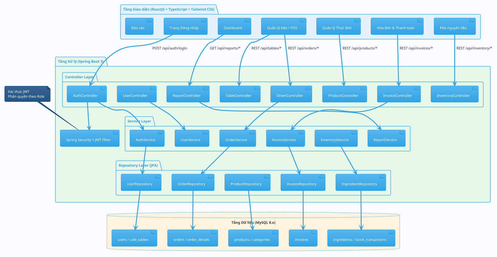
```plantuml
@startuml
!theme cerulean
skinparam backgroundColor #F8FBFF

package "Tầng Giao diện (ReactJS + TypeScript + Tailwind CSS)" #E3F2FD {
  [Trang Đăng nhập]
  [Dashboard]
  [Quản lý Bàn / POS]
  [Quản lý Thực đơn]
  [Hóa đơn & Thanh toán]
  [Kho nguyên liệu]
  [Báo cáo]
}

package "Tầng Xử lý (Spring Boot 3)" #E8F5E9 {
  package "Controller Layer" {
    [AuthController]
    [UserController]
    [TableController]
    [OrderController]
    [ProductController]
    [InvoiceController]
    [InventoryController]
    [ReportController]
  }
  package "Service Layer" {
    [AuthService]
    [UserService]
    [OrderService]
    [InvoiceService]
    [InventoryService]
    [ReportService]
  }
  package "Repository Layer (JPA)" {
    [UserRepository]
    [OrderRepository]
    [ProductRepository]
    [InvoiceRepository]
    [IngredientRepository]
  }
  [Spring Security + JWT Filter]
}

database "Tầng Dữ liệu (MySQL 8.x)" #FFF3E0 {
  [users / cafe_tables]
  [orders / order_details]
  [products / categories]
  [invoices]
  [ingredients / stock_transactions]
}

[Trang Đăng nhập] --> [AuthController] : POST /api/auth/login
[Dashboard] --> [ReportController] : GET /api/reports/*
[Quản lý Bàn / POS] --> [TableController] : REST /api/tables/*
[Quản lý Bàn / POS] --> [OrderController] : REST /api/orders/*
[Quản lý Thực đơn] --> [ProductController] : REST /api/products/*
[Hóa đơn & Thanh toán] --> [InvoiceController] : REST /api/invoices/*
[Kho nguyên liệu] --> [InventoryController] : REST /api/inventory/*

[AuthController] --> [Spring Security + JWT Filter]
[AuthController] --> [AuthService]
[UserController] --> [UserService]
[OrderController] --> [OrderService]
[InvoiceController] --> [InvoiceService]
[ReportController] --> [ReportService]

[AuthService] --> [UserRepository]
[OrderService] --> [OrderRepository]
[InvoiceService] --> [InvoiceRepository]
[InventoryService] --> [IngredientRepository]

[UserRepository] --> [users / cafe_tables]
[OrderRepository] --> [orders / order_details]
[ProductRepository] --> [products / categories]
[InvoiceRepository] --> [invoices]
[IngredientRepository] --> [ingredients / stock_transactions]

note top of [Spring Security + JWT Filter] : Xác thực JWT\nPhân quyền theo Role

@enduml
```

## 1.4 Thuật ngữ viết tắt

| STT | Từ viết tắt | Diễn giải |
|---|---|---|
| 1 | CMS | Cafe Management System – Hệ thống quản lý quán Cafe |
| 2 | SRS | Software Requirements Specification – Tài liệu đặc tả yêu cầu phần mềm |
| 3 | API | Application Programming Interface – Giao diện lập trình ứng dụng |
| 4 | JWT | JSON Web Token – Token xác thực người dùng |
| 5 | CRUD | Create, Read, Update, Delete – Thao tác cơ bản dữ liệu |
| 6 | ERD | Entity Relationship Diagram – Sơ đồ quan hệ thực thể |
| 7 | UC | Use Case – Trường hợp sử dụng |
| 8 | ID | Identifier – Mã định danh |
| 9 | FK | Foreign Key – Khóa ngoại |
| 10 | PK | Primary Key – Khóa chính |
| 11 | JPA | Java Persistence API |
| 12 | DTO | Data Transfer Object |
| 13 | POS | Point of Sale – Điểm bán hàng |
| 14 | UI | User Interface – Giao diện người dùng |
| 15 | UX | User Experience – Trải nghiệm người dùng |
| 16 | STT | Số thứ tự |
| 17 | CSDL | Cơ sở dữ liệu |

---

# PHẦN 2: YÊU CẦU TỔNG THỂ

## 2.1 Sơ đồ quan hệ đối tượng (ERD)

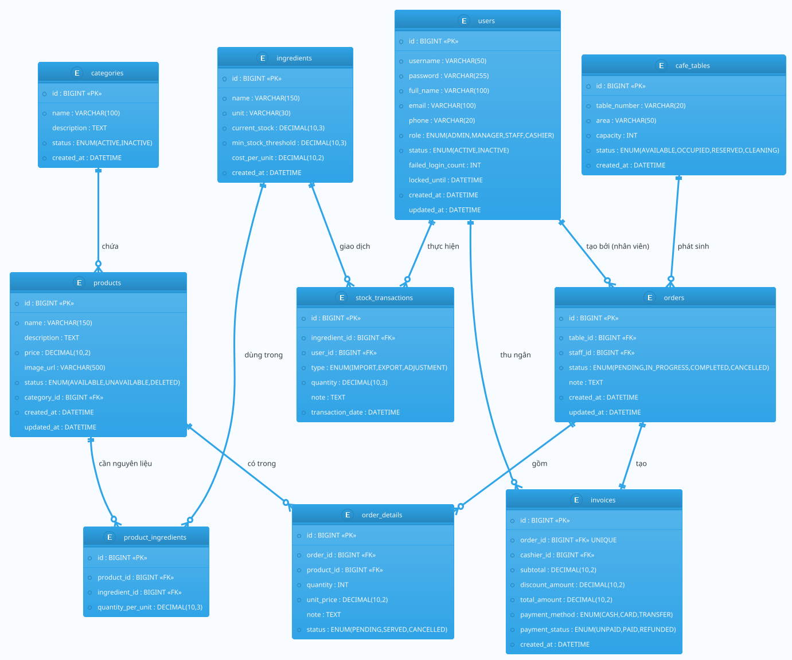
```plantuml
@startuml
!theme cerulean
skinparam backgroundColor #F8FBFF
skinparam entity {
  BorderColor #1565C0
  BackgroundColor #E3F2FD
}

entity "users" as user {
  * id : BIGINT <<PK>>
  --
  * username : VARCHAR(50)
  * password : VARCHAR(255)
  * full_name : VARCHAR(100)
  * email : VARCHAR(100)
  phone : VARCHAR(20)
  * role : ENUM(ADMIN,MANAGER,STAFF,CASHIER)
  * status : ENUM(ACTIVE,INACTIVE)
  failed_login_count : INT
  locked_until : DATETIME
  * created_at : DATETIME
  updated_at : DATETIME
}

entity "cafe_tables" as ctable {
  * id : BIGINT <<PK>>
  --
  * table_number : VARCHAR(20)
  * area : VARCHAR(50)
  * capacity : INT
  * status : ENUM(AVAILABLE,OCCUPIED,RESERVED,CLEANING)
  * created_at : DATETIME
}

entity "categories" as category {
  * id : BIGINT <<PK>>
  --
  * name : VARCHAR(100)
  description : TEXT
  * status : ENUM(ACTIVE,INACTIVE)
  * created_at : DATETIME
}

entity "products" as product {
  * id : BIGINT <<PK>>
  --
  * name : VARCHAR(150)
  description : TEXT
  * price : DECIMAL(10,2)
  image_url : VARCHAR(500)
  * status : ENUM(AVAILABLE,UNAVAILABLE,DELETED)
  * category_id : BIGINT <<FK>>
  * created_at : DATETIME
  updated_at : DATETIME
}

entity "orders" as orders {
  * id : BIGINT <<PK>>
  --
  * table_id : BIGINT <<FK>>
  * staff_id : BIGINT <<FK>>
  * status : ENUM(PENDING,IN_PROGRESS,COMPLETED,CANCELLED)
  note : TEXT
  * created_at : DATETIME
  updated_at : DATETIME
}

entity "order_details" as odetail {
  * id : BIGINT <<PK>>
  --
  * order_id : BIGINT <<FK>>
  * product_id : BIGINT <<FK>>
  * quantity : INT
  * unit_price : DECIMAL(10,2)
  note : TEXT
  * status : ENUM(PENDING,SERVED,CANCELLED)
}

entity "invoices" as invoice {
  * id : BIGINT <<PK>>
  --
  * order_id : BIGINT <<FK>> UNIQUE
  * cashier_id : BIGINT <<FK>>
  * subtotal : DECIMAL(10,2)
  * discount_amount : DECIMAL(10,2)
  * total_amount : DECIMAL(10,2)
  * payment_method : ENUM(CASH,CARD,TRANSFER)
  * payment_status : ENUM(UNPAID,PAID,REFUNDED)
  * created_at : DATETIME
}

entity "ingredients" as ingredient {
  * id : BIGINT <<PK>>
  --
  * name : VARCHAR(150)
  * unit : VARCHAR(30)
  * current_stock : DECIMAL(10,3)
  * min_stock_threshold : DECIMAL(10,3)
  cost_per_unit : DECIMAL(10,2)
  * created_at : DATETIME
}

entity "stock_transactions" as stock_tx {
  * id : BIGINT <<PK>>
  --
  * ingredient_id : BIGINT <<FK>>
  * user_id : BIGINT <<FK>>
  * type : ENUM(IMPORT,EXPORT,ADJUSTMENT)
  * quantity : DECIMAL(10,3)
  note : TEXT
  * transaction_date : DATETIME
}

entity "product_ingredients" as prod_ing {
  * id : BIGINT <<PK>>
  --
  * product_id : BIGINT <<FK>>
  * ingredient_id : BIGINT <<FK>>
  * quantity_per_unit : DECIMAL(10,3)
}

category ||--o{ product : "chứa"
product ||--o{ odetail : "có trong"
orders ||--o{ odetail : "gồm"
ctable ||--o{ orders : "phát sinh"
user ||--o{ orders : "tạo bởi (nhân viên)"
orders ||--|| invoice : "tạo"
user ||--o{ invoice : "thu ngân"
ingredient ||--o{ stock_tx : "giao dịch"
user ||--o{ stock_tx : "thực hiện"
product ||--o{ prod_ing : "cần nguyên liệu"
ingredient ||--o{ prod_ing : "dùng trong"

@enduml
```

## 2.2 Sơ đồ Use Case tổng thể

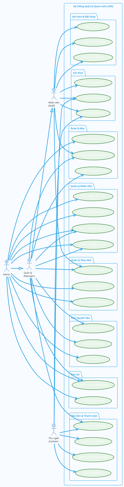
```plantuml
@startuml
!theme cerulean
skinparam backgroundColor #F8FBFF
left to right direction
skinparam actor {
  BorderColor #1565C0
  BackgroundColor #BBDEFB
}
skinparam usecase {
  BorderColor #2E7D32
  BackgroundColor #E8F5E9
}

actor "Admin" as admin
actor "Quản lý\n(Manager)" as manager
actor "Nhân viên\n(Staff)" as staff
actor "Thu ngân\n(Cashier)" as cashier

admin --|> manager
manager --|> staff

rectangle "Hệ thống Quản lý Quán Cafe (CMS)" {

  package "Xác thực" {
    usecase "UC01 - Đăng nhập" as UC01
    usecase "UC02 - Đăng xuất" as UC02
    usecase "UC03 - Đổi mật khẩu" as UC03
  }

  package "Quản lý Nhân viên" {
    usecase "UC04 - Xem danh sách NV" as UC04
    usecase "UC05 - Thêm nhân viên" as UC05
    usecase "UC06 - Sửa thông tin NV" as UC06
    usecase "UC07 - Khoá/Mở khoá TK" as UC07
  }

  package "Quản lý Bàn" {
    usecase "UC08 - Xem trạng thái bàn" as UC08
    usecase "UC09 - Thêm/Sửa/Xóa bàn" as UC09
    usecase "UC10 - Chuyển bàn" as UC10
  }

  package "Quản lý Thực đơn" {
    usecase "UC11 - Quản lý danh mục" as UC11
    usecase "UC12 - Thêm/Sửa/Xóa SP" as UC12
    usecase "UC13 - Xem thực đơn" as UC13
  }

  package "Gọi món & Đặt hàng" {
    usecase "UC14 - Tạo đơn hàng" as UC14
    usecase "UC15 - Thêm/Bớt món" as UC15
    usecase "UC16 - Huỷ món" as UC16
  }

  package "Hóa đơn & Thanh toán" {
    usecase "UC17 - Tạo hóa đơn" as UC17
    usecase "UC18 - Áp dụng giảm giá" as UC18
    usecase "UC19 - Thanh toán" as UC19
    usecase "UC20 - Xem lịch sử HĐ" as UC20
  }

  package "Kho nguyên liệu" {
    usecase "UC21 - Nhập kho" as UC21
    usecase "UC22 - Xem tồn kho" as UC22
    usecase "UC23 - Cảnh báo tồn kho" as UC23
  }

  package "Báo cáo" {
    usecase "UC24 - Báo cáo doanh thu" as UC24
    usecase "UC25 - SP bán chạy" as UC25
  }
}

admin --> UC04
admin --> UC05
admin --> UC06
admin --> UC07
admin --> UC09
admin --> UC11
admin --> UC12
admin --> UC21
admin --> UC24
admin --> UC25

manager --> UC04
manager --> UC06
manager --> UC08
manager --> UC10
manager --> UC13
manager --> UC20
manager --> UC22
manager --> UC23
manager --> UC24

staff --> UC01
staff --> UC02
staff --> UC03
staff --> UC08
staff --> UC13
staff --> UC14
staff --> UC15
staff --> UC16

cashier --> UC01
cashier --> UC02
cashier --> UC17
cashier --> UC18
cashier --> UC19
cashier --> UC20

@enduml
```

## 2.3 Sơ đồ luồng tổng thể

### Luồng nghiệp vụ chính: Từ gọi món đến thanh toán

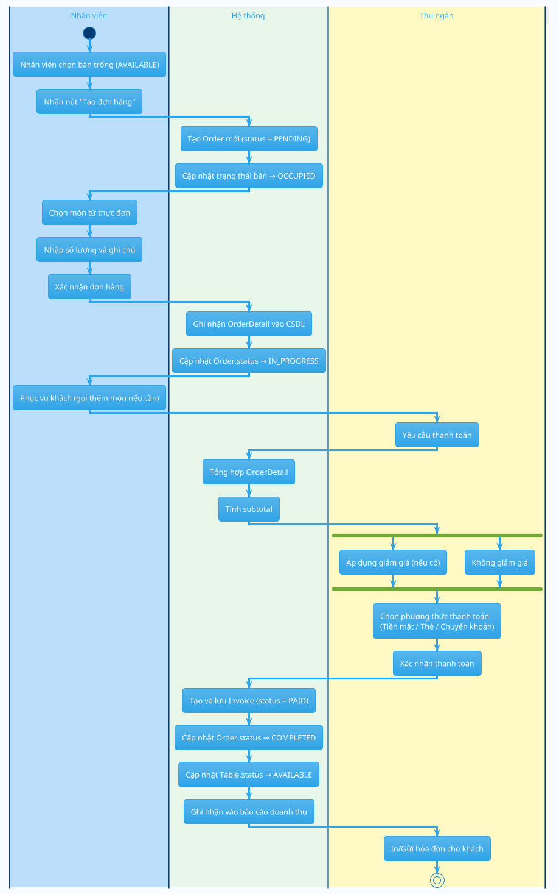
```plantuml
@startuml
!theme cerulean
skinparam backgroundColor #F8FBFF

|#BBDEFB|Nhân viên|
start
:Nhân viên chọn bàn trống (AVAILABLE);
:Nhấn nút "Tạo đơn hàng";

|#E8F5E9|Hệ thống|
:Tạo Order mới (status = PENDING);
:Cập nhật trạng thái bàn → OCCUPIED;

|#BBDEFB|Nhân viên|
:Chọn món từ thực đơn;
:Nhập số lượng và ghi chú;
:Xác nhận đơn hàng;

|#E8F5E9|Hệ thống|
:Ghi nhận OrderDetail vào CSDL;
:Cập nhật Order.status → IN_PROGRESS;

|#BBDEFB|Nhân viên|
:Phục vụ khách (gọi thêm món nếu cần);

|#FFF9C4|Thu ngân|
:Yêu cầu thanh toán;

|#E8F5E9|Hệ thống|
:Tổng hợp OrderDetail;
:Tính subtotal;

|#FFF9C4|Thu ngân|
fork
  :Áp dụng giảm giá (nếu có);
fork again
  :Không giảm giá;
end fork

:Chọn phương thức thanh toán\n(Tiền mặt / Thẻ / Chuyển khoản);
:Xác nhận thanh toán;

|#E8F5E9|Hệ thống|
:Tạo và lưu Invoice (status = PAID);
:Cập nhật Order.status → COMPLETED;
:Cập nhật Table.status → AVAILABLE;
:Ghi nhận vào báo cáo doanh thu;

|#FFF9C4|Thu ngân|
:In/Gửi hóa đơn cho khách;
stop

@enduml
```

## 2.4 Sơ đồ chuyển trạng thái

### Trạng thái Bàn (Table Status)

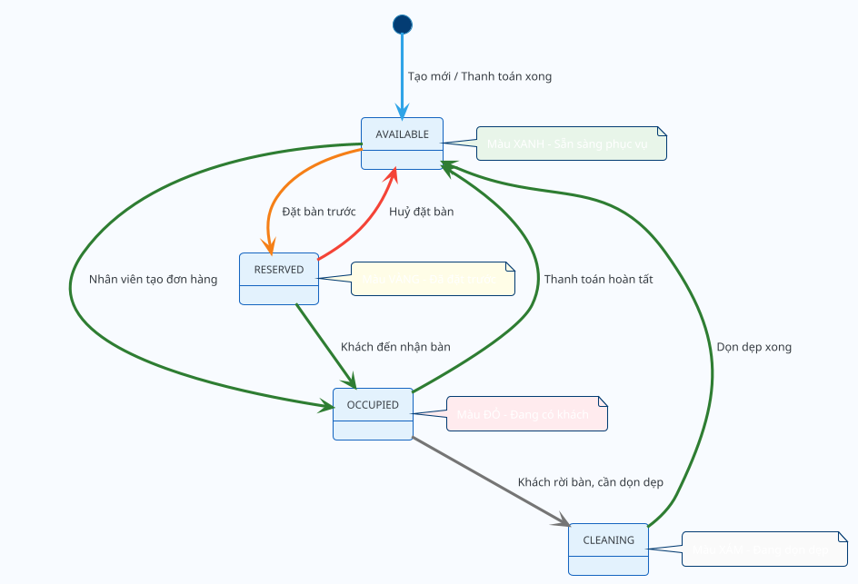
```plantuml
@startuml
!theme cerulean
skinparam backgroundColor #F8FBFF
skinparam state {
  BackgroundColor #E3F2FD
  BorderColor #1565C0
}

[*] --> AVAILABLE : Tạo mới / Thanh toán xong

AVAILABLE -[#2E7D32]-> OCCUPIED : Nhân viên tạo đơn hàng
AVAILABLE -[#F57F17]-> RESERVED : Đặt bàn trước

OCCUPIED -[#2E7D32]-> AVAILABLE : Thanh toán hoàn tất
OCCUPIED -[#757575]-> CLEANING : Khách rời bàn, cần dọn dẹp

RESERVED -[#2E7D32]-> OCCUPIED : Khách đến nhận bàn
RESERVED -[#F44336]-> AVAILABLE : Huỷ đặt bàn

CLEANING -[#2E7D32]-> AVAILABLE : Dọn dẹp xong

note right of AVAILABLE #E8F5E9 : Màu XANH – Sẵn sàng phục vụ
note right of OCCUPIED #FFEBEE : Màu ĐỎ – Đang có khách
note right of RESERVED #FFFDE7 : Màu VÀNG – Đã đặt trước
note right of CLEANING #FAFAFA : Màu XÁM – Đang dọn dẹp

@enduml
```

### Trạng thái Đơn hàng (Order Status)

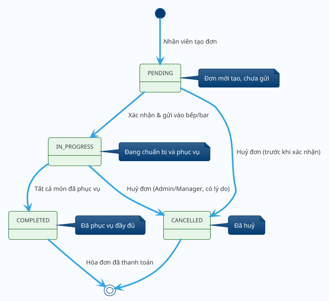
```plantuml
@startuml
!theme cerulean
skinparam backgroundColor #F8FBFF
skinparam state {
  BackgroundColor #E8F5E9
  BorderColor #2E7D32
}

[*] --> PENDING : Nhân viên tạo đơn

PENDING --> IN_PROGRESS : Xác nhận & gửi vào bếp/bar
PENDING --> CANCELLED : Huỷ đơn (trước khi xác nhận)

IN_PROGRESS --> COMPLETED : Tất cả món đã phục vụ
IN_PROGRESS --> CANCELLED : Huỷ đơn (Admin/Manager, có lý do)

COMPLETED --> [*] : Hóa đơn đã thanh toán
CANCELLED --> [*]

note right of PENDING : Đơn mới tạo, chưa gửi
note right of IN_PROGRESS : Đang chuẩn bị và phục vụ
note right of COMPLETED : Đã phục vụ đầy đủ
note right of CANCELLED : Đã huỷ

@enduml
```

### Trạng thái Hóa đơn (Invoice Status)

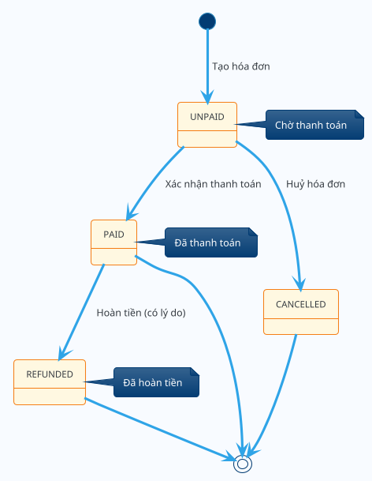
```plantuml
@startuml
!theme cerulean
skinparam backgroundColor #F8FBFF
skinparam state {
  BackgroundColor #FFF8E1
  BorderColor #F57F17
}

[*] --> UNPAID : Tạo hóa đơn

UNPAID --> PAID : Xác nhận thanh toán
UNPAID --> CANCELLED : Huỷ hóa đơn

PAID --> REFUNDED : Hoàn tiền (có lý do)

PAID --> [*]
REFUNDED --> [*]
CANCELLED --> [*]

note right of UNPAID : Chờ thanh toán
note right of PAID : Đã thanh toán
note right of REFUNDED : Đã hoàn tiền

@enduml
```

## 2.5 Phân quyền

### 2.5.1 Phân quyền chức năng

| Chức năng | Admin | Manager | Staff | Cashier |
|---|:---:|:---:|:---:|:---:|
| **Xác thực** | | | | |
| Đăng nhập / Đăng xuất | ✅ | ✅ | ✅ | ✅ |
| Đổi mật khẩu | ✅ | ✅ | ✅ | ✅ |
| **Quản lý Nhân viên** | | | | |
| Xem danh sách nhân viên | ✅ | ✅ | ❌ | ❌ |
| Thêm nhân viên | ✅ | ❌ | ❌ | ❌ |
| Sửa thông tin nhân viên | ✅ | ✅ (bản thân) | ✅ (bản thân) | ✅ (bản thân) |
| Khoá / Mở khoá tài khoản | ✅ | ❌ | ❌ | ❌ |
| **Quản lý Bàn** | | | | |
| Xem trạng thái bàn | ✅ | ✅ | ✅ | ✅ |
| Thêm / Sửa / Xóa bàn | ✅ | ✅ | ❌ | ❌ |
| Chuyển bàn | ✅ | ✅ | ✅ | ❌ |
| **Quản lý Thực đơn** | | | | |
| Xem thực đơn | ✅ | ✅ | ✅ | ✅ |
| Quản lý danh mục | ✅ | ✅ | ❌ | ❌ |
| Thêm / Sửa / Xóa sản phẩm | ✅ | ✅ | ❌ | ❌ |
| **Gọi món & Đặt hàng** | | | | |
| Tạo đơn hàng | ✅ | ✅ | ✅ | ❌ |
| Thêm / Bớt món | ✅ | ✅ | ✅ | ❌ |
| Huỷ món | ✅ | ✅ | ✅ (chưa xác nhận) | ❌ |
| **Hóa đơn & Thanh toán** | | | | |
| Tạo hóa đơn | ✅ | ✅ | ❌ | ✅ |
| Áp dụng giảm giá | ✅ | ✅ | ❌ | ✅ |
| Thanh toán | ✅ | ✅ | ❌ | ✅ |
| Xem lịch sử hóa đơn | ✅ | ✅ | ❌ | ✅ |
| **Kho nguyên liệu** | | | | |
| Xem tồn kho | ✅ | ✅ | ❌ | ❌ |
| Nhập kho | ✅ | ✅ | ❌ | ❌ |
| Điều chỉnh tồn kho | ✅ | ✅ | ❌ | ❌ |
| **Báo cáo** | | | | |
| Báo cáo doanh thu | ✅ | ✅ | ❌ | ❌ |
| Sản phẩm bán chạy | ✅ | ✅ | ❌ | ❌ |

### 2.5.2 Phân quyền dữ liệu

| Vai trò | Phạm vi dữ liệu |
|---|---|
| **Admin** | Toàn bộ dữ liệu hệ thống |
| **Manager** | Dữ liệu trong ca làm việc, báo cáo theo cửa hàng |
| **Staff** | Chỉ đơn hàng mà mình phụ trách |
| **Cashier** | Hóa đơn và lịch sử thanh toán |

## 2.6 Site Map

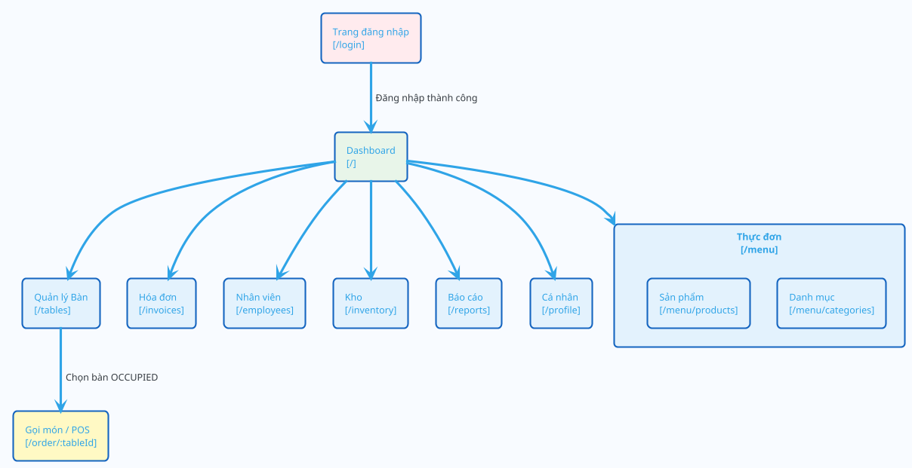
```plantuml
@startuml
!theme cerulean
skinparam backgroundColor #F8FBFF
skinparam rectangle {
  BorderColor #1565C0
  BackgroundColor #E3F2FD
  RoundCorner 10
}

rectangle "Trang đăng nhập\n[/login]" as login #FFEBEE

rectangle "Dashboard\n[/]" as dash #E8F5E9

rectangle "Quản lý Bàn\n[/tables]" as tables
rectangle "Gọi món / POS\n[/order/:tableId]" as order #FFF9C4

rectangle "Thực đơn\n[/menu]" as menu {
  rectangle "Danh mục\n[/menu/categories]" as cat
  rectangle "Sản phẩm\n[/menu/products]" as prod
}

rectangle "Hóa đơn\n[/invoices]" as invoice
rectangle "Nhân viên\n[/employees]" as emp
rectangle "Kho\n[/inventory]" as inventory
rectangle "Báo cáo\n[/reports]" as reports
rectangle "Cá nhân\n[/profile]" as profile

login --> dash : Đăng nhập thành công
dash --> tables
dash --> menu
dash --> invoice
dash --> emp
dash --> inventory
dash --> reports
dash --> profile
tables --> order : Chọn bàn OCCUPIED

@enduml
```

---

# PHẦN 3: CHỨC NĂNG CHI TIẾT

---

## 3.1 Quản lý Xác thực & Tài khoản

### Danh sách chức năng

| Mã | Tên chức năng | Phân hệ | Tác nhân (Actor) |
|---|---|---|---|
| UC01 | Đăng nhập | Authentication | Tất cả vai trò |
| UC02 | Đăng xuất | Authentication | Tất cả vai trò |
| UC03 | Đổi mật khẩu | Authentication | Tất cả vai trò |

---

### 3.1.1 UC01 – Đăng nhập

#### Đặc tả Use Case

| Trường | Nội dung |
|---|---|
| **Use Case ID** | UC01 |
| **Mô tả** | Người dùng nhập thông tin đăng nhập để xác thực và nhận JWT token truy cập hệ thống |
| **Tác nhân** | Admin, Manager, Staff, Cashier |
| **Ưu tiên** | Cao (P1) |
| **Trigger** | Người dùng mở ứng dụng và nhập thông tin đăng nhập |
| **Điều kiện cần** | Tài khoản đã được tạo trong hệ thống và có trạng thái ACTIVE |
| **Điều kiện sau** | Người dùng được xác thực thành công, nhận JWT Access Token và Refresh Token, điều hướng đến Dashboard |

**Luồng cơ bản (Basic Flow):**

| Bước | Tác nhân | Hành động |
|---|---|---|
| 1 | Người dùng | Truy cập trang đăng nhập /login |
| 2 | Hệ thống | Hiển thị form đăng nhập (Tên đăng nhập, Mật khẩu) |
| 3 | Người dùng | Nhập tên đăng nhập và mật khẩu |
| 4 | Người dùng | Nhấn nút "Đăng nhập" |
| 5 | Hệ thống | Gửi request POST /api/auth/login với {username, password} |
| 6 | Hệ thống | Xác thực thông tin với CSDL |
| 7 | Hệ thống | Tạo JWT Access Token (15 phút) và Refresh Token (7 ngày) |
| 8 | Hệ thống | Trả về token và thông tin user (role, name) |
| 9 | Hệ thống | Lưu token vào localStorage/httpOnly cookie |
| 10 | Hệ thống | Điều hướng người dùng đến Dashboard theo role |

**Luồng thay thế (Alternative Flow):**

| Trường hợp | Xử lý |
|---|---|
| A1: Sai username/password | Hiển thị thông báo "Tên đăng nhập hoặc mật khẩu không đúng" |
| A2: Tài khoản bị khoá | Hiển thị "Tài khoản của bạn đã bị khoá. Vui lòng liên hệ Admin" |
| A3: Để trống trường | Validate client-side, hiển thị "Vui lòng nhập đầy đủ thông tin" |

**Luồng ngoại lệ (Exception Flow):**

| Trường hợp | Xử lý |
|---|---|
| E1: Lỗi kết nối server | Hiển thị "Không thể kết nối máy chủ. Vui lòng thử lại sau" |
| E2: Token hết hạn trong phiên | Tự động gọi refresh token API; nếu thất bại thì redirect về trang login |

**Ràng buộc nghiệp vụ:**
- Mật khẩu phải được mã hoá bằng BCrypt (salt rounds = 12).
- Đăng nhập thất bại 5 lần liên tiếp → khoá tài khoản tạm thời 30 phút.
- JWT Access Token hết hạn sau 15 phút; Refresh Token hết hạn sau 7 ngày.

#### 3.1.1.1 Sơ đồ luồng chi tiết UC01

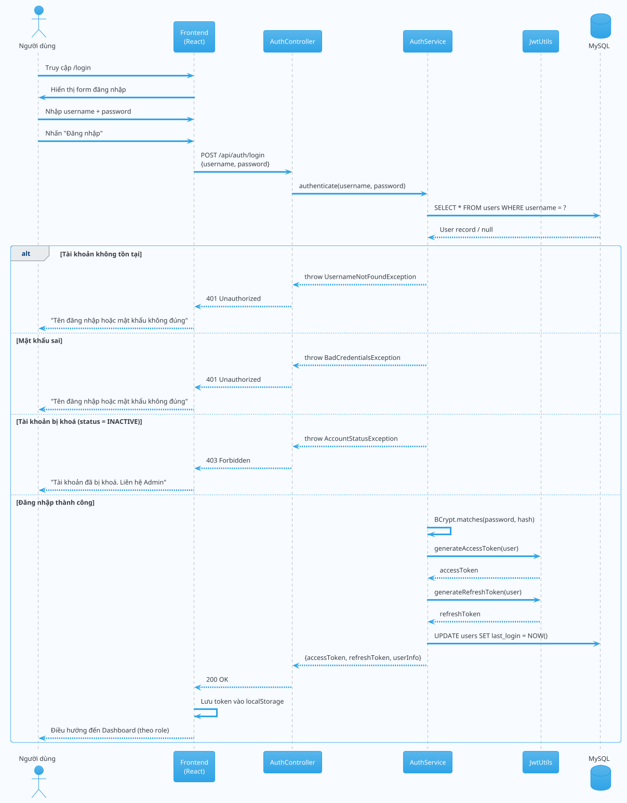
```plantuml
@startuml
!theme cerulean
skinparam backgroundColor #F8FBFF

actor "Người dùng" as user
participant "Frontend\n(React)" as fe
participant "AuthController" as ctrl
participant "AuthService" as svc
participant "JwtUtils" as jwt
database "MySQL" as db

user -> fe : Truy cập /login
fe -> user : Hiển thị form đăng nhập

user -> fe : Nhập username + password
user -> fe : Nhấn "Đăng nhập"

fe -> ctrl : POST /api/auth/login\n{username, password}

ctrl -> svc : authenticate(username, password)
svc -> db : SELECT * FROM users WHERE username = ?
db --> svc : User record / null

alt Tài khoản không tồn tại
    svc --> ctrl : throw UsernameNotFoundException
    ctrl --> fe : 401 Unauthorized
    fe --> user : "Tên đăng nhập hoặc mật khẩu không đúng"

else Mật khẩu sai
    svc --> ctrl : throw BadCredentialsException
    ctrl --> fe : 401 Unauthorized
    fe --> user : "Tên đăng nhập hoặc mật khẩu không đúng"

else Tài khoản bị khoá (status = INACTIVE)
    svc --> ctrl : throw AccountStatusException
    ctrl --> fe : 403 Forbidden
    fe --> user : "Tài khoản đã bị khoá. Liên hệ Admin"

else Đăng nhập thành công
    svc -> svc : BCrypt.matches(password, hash)
    svc -> jwt : generateAccessToken(user)
    jwt --> svc : accessToken
    svc -> jwt : generateRefreshToken(user)
    jwt --> svc : refreshToken
    svc -> db : UPDATE users SET last_login = NOW()
    svc --> ctrl : {accessToken, refreshToken, userInfo}
    ctrl --> fe : 200 OK
    fe -> fe : Lưu token vào localStorage
    fe --> user : Điều hướng đến Dashboard (theo role)
end

@enduml
```

#### 3.1.1.2 Mô tả chi tiết fields

| Tên tiếng Việt | Tên tiếng Anh | Kiểu | Bắt buộc? | Mô tả |
|---|---|---|:---:|---|
| Tên đăng nhập | username | String | ✅ | Độ dài 4–50 ký tự, không có khoảng trắng |
| Mật khẩu | password | String | ✅ | Tối thiểu 6 ký tự |

---

### 3.1.2 UC02 – Đăng xuất

#### Đặc tả Use Case

| Trường | Nội dung |
|---|---|
| **Use Case ID** | UC02 |
| **Mô tả** | Người dùng kết thúc phiên làm việc, vô hiệu hoá token |
| **Tác nhân** | Tất cả vai trò |
| **Ưu tiên** | Cao (P1) |
| **Trigger** | Người dùng nhấn nút "Đăng xuất" |
| **Điều kiện cần** | Người dùng đang đăng nhập (có Access Token hợp lệ) |
| **Điều kiện sau** | Refresh Token bị vô hiệu hoá, người dùng chuyển về trang Đăng nhập |

**Luồng cơ bản:**

| Bước | Mô tả |
|---|---|
| 1 | Người dùng nhấn nút "Đăng xuất" trên thanh điều hướng |
| 2 | Hệ thống gọi POST /api/auth/logout với Refresh Token |
| 3 | Server xoá Access Token và Refresh Token khỏi danh sách hợp lệ |
| 4 | Frontend xoá token khỏi localStorage |
| 5 | Điều hướng về trang Đăng nhập |

---

### 3.1.3 UC03 – Đổi mật khẩu

#### Đặc tả Use Case

| Trường | Nội dung |
|---|---|
| **Use Case ID** | UC03 |
| **Mô tả** | Người dùng đã đăng nhập thực hiện thay đổi mật khẩu của mình |
| **Tác nhân** | Tất cả vai trò (đã đăng nhập) |
| **Ưu tiên** | Trung bình (P2) |
| **Trigger** | Người dùng vào "Hồ sơ cá nhân" → chọn "Đổi mật khẩu" |
| **Điều kiện cần** | Người dùng đã đăng nhập thành công |
| **Điều kiện sau** | Mật khẩu được cập nhật, tất cả token cũ bị vô hiệu hoá, người dùng được yêu cầu đăng nhập lại |

**Luồng cơ bản:**

| Bước | Mô tả |
|---|---|
| 1 | Người dùng truy cập trang "Đổi mật khẩu" |
| 2 | Hệ thống hiển thị form: Mật khẩu hiện tại, Mật khẩu mới, Xác nhận mật khẩu mới |
| 3 | Người dùng nhập thông tin và nhấn "Lưu" |
| 4 | Hệ thống gọi API PUT /api/users/change-password |
| 5 | Hệ thống kiểm tra mật khẩu hiện tại |
| 6 | Hệ thống cập nhật mật khẩu mới (BCrypt) |
| 7 | Hệ thống vô hiệu hoá tất cả Refresh Token cũ |
| 8 | Thông báo thành công và redirect về trang Đăng nhập |

**Mô tả chi tiết fields:**

| Tên tiếng Việt | Tên tiếng Anh | Kiểu | Bắt buộc? | Mô tả |
|---|---|---|:---:|---|
| Mật khẩu hiện tại | currentPassword | String | ✅ | Phải khớp với mật khẩu đang dùng |
| Mật khẩu mới | newPassword | String | ✅ | Tối thiểu 6 ký tự, có chữ hoa + số |
| Xác nhận mật khẩu mới | confirmPassword | String | ✅ | Phải giống newPassword |

---

## 3.2 Quản lý Nhân viên

### Danh sách chức năng

| Mã | Tên chức năng | Phân hệ | Tác nhân |
|---|---|---|---|
| UC04 | Xem danh sách nhân viên | HR | Admin, Manager |
| UC05 | Thêm nhân viên | HR | Admin |
| UC06 | Sửa thông tin nhân viên | HR | Admin, Manager |
| UC07 | Khoá / Mở khoá tài khoản | HR | Admin |

---

### 3.2.1 UC05 – Thêm nhân viên

#### Đặc tả Use Case

| Trường | Nội dung |
|---|---|
| **Use Case ID** | UC05 |
| **Mô tả** | Admin thêm mới một nhân viên vào hệ thống với đầy đủ thông tin và phân vai trò |
| **Tác nhân** | Admin |
| **Ưu tiên** | Cao (P1) |
| **Trigger** | Admin vào "Quản lý Nhân viên" → nhấn "Thêm nhân viên" |
| **Điều kiện cần** | Đã đăng nhập với role ADMIN |
| **Điều kiện sau** | Nhân viên mới được lưu vào CSDL với trạng thái ACTIVE |

**Luồng cơ bản:**

| Bước | Tác nhân | Hành động |
|---|---|---|
| 1 | Admin | Vào trang /employees → nhấn "Thêm nhân viên" |
| 2 | Hệ thống | Hiển thị form thêm nhân viên |
| 3 | Admin | Nhập thông tin: Họ tên, Tên đăng nhập, Email, SĐT, Vai trò, Mật khẩu tạm thời |
| 4 | Admin | Nhấn "Lưu" |
| 5 | Hệ thống | Validate dữ liệu (username unique, email format...) |
| 6 | Hệ thống | Mã hoá mật khẩu bằng BCrypt |
| 7 | Hệ thống | Lưu bản ghi vào bảng users với status = ACTIVE |
| 8 | Hệ thống | Hiển thị thông báo "Thêm nhân viên thành công" |

**Luồng thay thế:**

| Trường hợp | Xử lý |
|---|---|
| A1: Tên đăng nhập đã tồn tại | Thông báo lỗi "Tên đăng nhập đã được sử dụng" |
| A2: Email đã tồn tại | Thông báo lỗi "Email này đã được đăng ký" |

#### 3.2.1.1 Sơ đồ luồng UC05

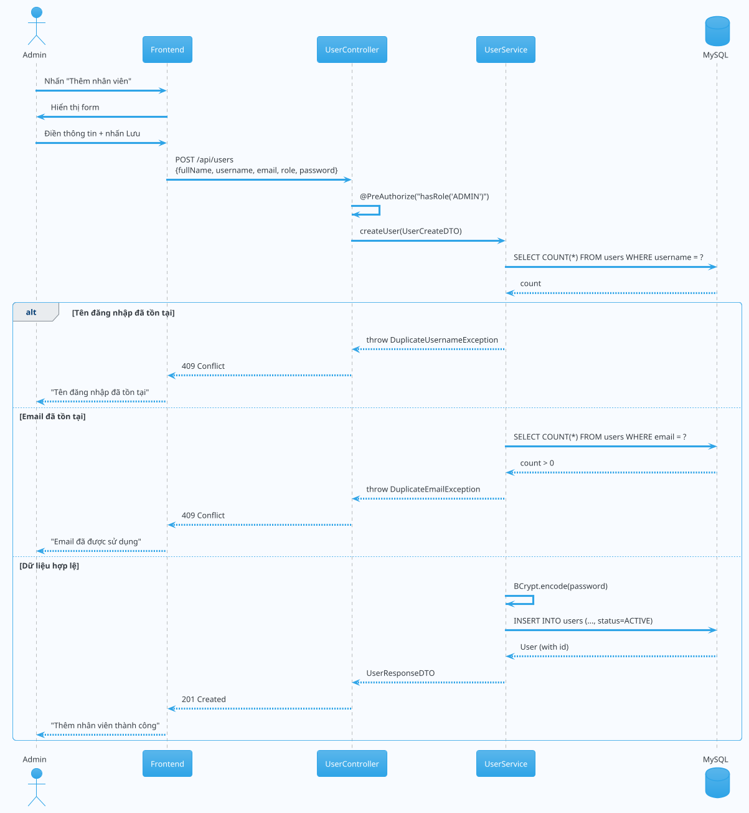
```plantuml
@startuml
!theme cerulean
skinparam backgroundColor #F8FBFF

actor "Admin" as admin
participant "Frontend" as fe
participant "UserController" as ctrl
participant "UserService" as svc
database "MySQL" as db

admin -> fe : Nhấn "Thêm nhân viên"
fe -> admin : Hiển thị form

admin -> fe : Điền thông tin + nhấn Lưu
fe -> ctrl : POST /api/users\n{fullName, username, email, role, password}

ctrl -> ctrl : @PreAuthorize("hasRole('ADMIN')")
ctrl -> svc : createUser(UserCreateDTO)
svc -> db : SELECT COUNT(*) FROM users WHERE username = ?
db --> svc : count

alt Tên đăng nhập đã tồn tại
    svc --> ctrl : throw DuplicateUsernameException
    ctrl --> fe : 409 Conflict
    fe --> admin : "Tên đăng nhập đã tồn tại"

else Email đã tồn tại
    svc -> db : SELECT COUNT(*) FROM users WHERE email = ?
    db --> svc : count > 0
    svc --> ctrl : throw DuplicateEmailException
    ctrl --> fe : 409 Conflict
    fe --> admin : "Email đã được sử dụng"

else Dữ liệu hợp lệ
    svc -> svc : BCrypt.encode(password)
    svc -> db : INSERT INTO users (..., status=ACTIVE)
    db --> svc : User (with id)
    svc --> ctrl : UserResponseDTO
    ctrl --> fe : 201 Created
    fe --> admin : "Thêm nhân viên thành công"
end

@enduml
```

#### 3.2.1.2 Mô tả chi tiết fields

| Tên tiếng Việt | Tên tiếng Anh | Kiểu | Bắt buộc? | Mô tả |
|---|---|---|:---:|---|
| Họ và tên | fullName | String | ✅ | 2–100 ký tự |
| Tên đăng nhập | username | String | ✅ | 4–50 ký tự, unique, không có khoảng trắng |
| Email | email | String | ✅ | Đúng định dạng email, unique |
| Số điện thoại | phone | String | ❌ | 10 số, bắt đầu bằng 0 |
| Vai trò | role | Enum | ✅ | MANAGER / STAFF / CASHIER |
| Mật khẩu | password | String | ✅ | Tối thiểu 6 ký tự |
| Trạng thái | status | Enum | ❌ | Mặc định: ACTIVE |

---

### 3.2.2 UC07 – Khoá / Mở khoá tài khoản

#### Đặc tả Use Case

| Trường | Nội dung |
|---|---|
| **Use Case ID** | UC07 |
| **Mô tả** | Admin thay đổi trạng thái tài khoản nhân viên (ACTIVE ↔ INACTIVE) |
| **Tác nhân** | Admin |
| **Ưu tiên** | Trung bình (P2) |
| **Trigger** | Admin chọn nhân viên trong danh sách → nhấn "Khoá tài khoản" hoặc "Mở khoá" |
| **Điều kiện cần** | Đã đăng nhập với role ADMIN; Tài khoản nhân viên tồn tại |
| **Điều kiện sau** | Trạng thái tài khoản được cập nhật; Nếu khoá thì tất cả Refresh Token của nhân viên đó bị vô hiệu hoá |

**Ràng buộc nghiệp vụ:**
- Admin không thể tự khoá chính tài khoản của mình.
- Nhân viên bị khoá không thể đăng nhập cho đến khi được mở khoá.

---

## 3.3 Quản lý Bàn

### Danh sách chức năng

| Mã | Tên chức năng | Phân hệ | Tác nhân |
|---|---|---|---|
| UC08 | Xem trạng thái bàn | Table Management | Admin, Manager, Staff, Cashier |
| UC09 | Thêm / Sửa / Xoá bàn | Table Management | Admin, Manager |
| UC10 | Chuyển bàn | Table Management | Admin, Manager, Staff |

---

### 3.3.1 UC08 – Xem trạng thái bàn

#### Đặc tả Use Case

| Trường | Nội dung |
|---|---|
| **Use Case ID** | UC08 |
| **Mô tả** | Người dùng xem sơ đồ tổng thể trạng thái các bàn trong quán theo khu vực |
| **Tác nhân** | Admin, Manager, Staff, Cashier |
| **Ưu tiên** | Cao (P1) |
| **Trigger** | Người dùng truy cập trang "Quản lý Bàn" |
| **Điều kiện cần** | Đã đăng nhập |
| **Điều kiện sau** | Hệ thống hiển thị danh sách/sơ đồ bàn theo trạng thái hiện tại |

**Luồng cơ bản:**

| Bước | Mô tả |
|---|---|
| 1 | Người dùng truy cập /tables |
| 2 | Hệ thống gọi GET /api/tables để lấy danh sách bàn |
| 3 | Hiển thị sơ đồ bàn với màu sắc theo trạng thái |
| 4 | Người dùng nhấn vào bàn để xem chi tiết đơn hàng hiện tại |

**Mô tả màu sắc trạng thái:**

| Trạng thái | Màu hiển thị | Hành động khả dụng |
|---|---|---|
| AVAILABLE | Xanh lá | Tạo đơn hàng |
| OCCUPIED | Đỏ | Xem chi tiết, Chuyển bàn, Thanh toán |
| RESERVED | Vàng | Xác nhận khách đến, Huỷ đặt bàn |
| CLEANING | Xám | Đánh dấu hoàn thành dọn dẹp |

#### 3.3.1.1 Mô tả chi tiết fields hiển thị

| Tên tiếng Việt | Tên tiếng Anh | Kiểu | Mô tả |
|---|---|---|---|
| Số bàn | tableNumber | String | Ký hiệu định danh bàn (VD: A01, B03) |
| Khu vực | area | String | Trong nhà, Ngoài trời, Tầng 1, Tầng 2 |
| Sức chứa | capacity | Integer | Số khách tối đa |
| Trạng thái | status | Enum | AVAILABLE/OCCUPIED/RESERVED/CLEANING |
| Thời gian sử dụng | occupiedSince | DateTime | Thời gian khách bắt đầu ngồi |
| Đơn hàng hiện tại | currentOrderId | Long | Mã đơn hàng đang xử lý (nếu OCCUPIED) |

---

### 3.3.2 UC10 – Chuyển bàn

#### Đặc tả Use Case

| Trường | Nội dung |
|---|---|
| **Use Case ID** | UC10 |
| **Mô tả** | Nhân viên chuyển toàn bộ đơn hàng từ bàn đang sử dụng sang bàn khác |
| **Tác nhân** | Admin, Manager, Staff |
| **Ưu tiên** | Trung bình (P2) |
| **Trigger** | Nhân viên chọn "Chuyển bàn" trên bàn đang có khách |
| **Điều kiện cần** | Bàn nguồn ở trạng thái OCCUPIED; Bàn đích ở trạng thái AVAILABLE |
| **Điều kiện sau** | Order được liên kết với bàn đích; Bàn nguồn → AVAILABLE; Bàn đích → OCCUPIED |

**Luồng cơ bản:**

| Bước | Mô tả |
|---|---|
| 1 | Nhân viên chọn bàn đang có khách → nhấn "Chuyển bàn" |
| 2 | Hệ thống hiển thị danh sách các bàn AVAILABLE |
| 3 | Nhân viên chọn bàn đích |
| 4 | Hệ thống cập nhật table_id của Order sang bàn đích |
| 5 | Hệ thống cập nhật trạng thái hai bàn tương ứng |
| 6 | Hệ thống thông báo "Chuyển bàn thành công" |

**Ràng buộc nghiệp vụ:**
- Bàn đích phải ở trạng thái AVAILABLE.
- Không thể chuyển bàn khi hóa đơn đã được tạo và chưa thanh toán.

---

## 3.4 Quản lý Thực đơn & Sản phẩm

### Danh sách chức năng

| Mã | Tên chức năng | Phân hệ | Tác nhân |
|---|---|---|---|
| UC11 | Quản lý danh mục | Menu | Admin, Manager |
| UC12 | Thêm / Sửa / Xoá sản phẩm | Menu | Admin, Manager |
| UC13 | Xem thực đơn | Menu | Tất cả |

---

### 3.4.1 UC12 – Thêm / Sửa / Xoá sản phẩm

#### Đặc tả Use Case

| Trường | Nội dung |
|---|---|
| **Use Case ID** | UC12 |
| **Mô tả** | Admin/Manager quản lý (thêm, sửa, xoá mềm) các sản phẩm trong thực đơn |
| **Tác nhân** | Admin, Manager |
| **Ưu tiên** | Cao (P1) |
| **Trigger** | Người dùng vào "Thực đơn → Sản phẩm" → chọn thao tác tương ứng |
| **Điều kiện cần** | Đã đăng nhập với role ADMIN hoặc MANAGER; Danh mục đã tồn tại |
| **Điều kiện sau** | Dữ liệu sản phẩm được lưu/cập nhật/xoá mềm trong CSDL |

**Luồng cơ bản – Thêm sản phẩm:**

| Bước | Tác nhân | Hành động |
|---|---|---|
| 1 | Admin/Manager | Vào /menu/products → nhấn "Thêm sản phẩm" |
| 2 | Hệ thống | Hiển thị form thêm sản phẩm |
| 3 | Admin/Manager | Nhập: Tên, Danh mục, Giá, Mô tả, Upload ảnh, Trạng thái |
| 4 | Admin/Manager | Nhấn "Lưu" |
| 5 | Hệ thống | Validate dữ liệu (tên không rỗng, giá > 0) |
| 6 | Hệ thống | Upload ảnh lên server |
| 7 | Hệ thống | Lưu sản phẩm vào CSDL với status = AVAILABLE |
| 8 | Hệ thống | Thông báo "Thêm sản phẩm thành công" |

**Ràng buộc nghiệp vụ:**
- Xoá sản phẩm là xoá mềm (soft delete): cập nhật status = DELETED, không xoá vật lý.
- Sản phẩm đang có trong đơn hàng PENDING/IN_PROGRESS → không được xoá.
- Giá bán tối thiểu: 1.000 VNĐ.

#### 3.4.1.1 Sơ đồ luồng UC12 – Thêm sản phẩm

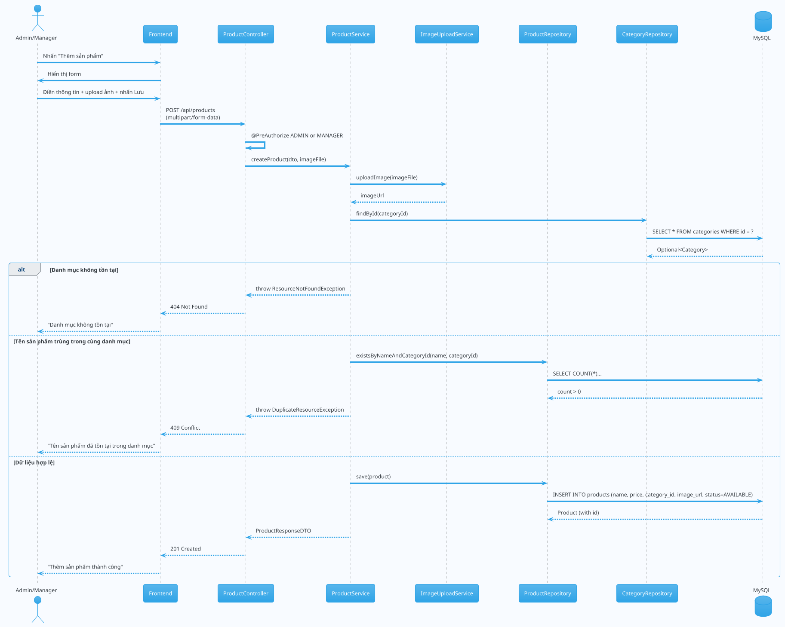
```plantuml
@startuml
!theme cerulean
skinparam backgroundColor #F8FBFF

actor "Admin/Manager" as admin
participant "Frontend" as fe
participant "ProductController" as ctrl
participant "ProductService" as svc
participant "ImageUploadService" as img
participant "ProductRepository" as repo
participant "CategoryRepository" as crepo
database "MySQL" as db

admin -> fe : Nhấn "Thêm sản phẩm"
fe -> admin : Hiển thị form

admin -> fe : Điền thông tin + upload ảnh + nhấn Lưu
fe -> ctrl : POST /api/products\n(multipart/form-data)

ctrl -> ctrl : @PreAuthorize ADMIN or MANAGER
ctrl -> svc : createProduct(dto, imageFile)

svc -> img : uploadImage(imageFile)
img --> svc : imageUrl

svc -> crepo : findById(categoryId)
crepo -> db : SELECT * FROM categories WHERE id = ?
db --> crepo : Optional<Category>

alt Danh mục không tồn tại
    svc --> ctrl : throw ResourceNotFoundException
    ctrl --> fe : 404 Not Found
    fe --> admin : "Danh mục không tồn tại"

else Tên sản phẩm trùng trong cùng danh mục
    svc -> repo : existsByNameAndCategoryId(name, categoryId)
    repo -> db : SELECT COUNT(*)...
    db --> repo : count > 0
    svc --> ctrl : throw DuplicateResourceException
    ctrl --> fe : 409 Conflict
    fe --> admin : "Tên sản phẩm đã tồn tại trong danh mục"

else Dữ liệu hợp lệ
    svc -> repo : save(product)
    repo -> db : INSERT INTO products (name, price, category_id, image_url, status=AVAILABLE)
    db --> repo : Product (with id)
    svc --> ctrl : ProductResponseDTO
    ctrl --> fe : 201 Created
    fe --> admin : "Thêm sản phẩm thành công"
end

@enduml
```

#### 3.4.1.2 Mô tả chi tiết fields

| Tên tiếng Việt | Tên tiếng Anh | Kiểu | Bắt buộc? | Mô tả |
|---|---|---|:---:|---|
| Tên sản phẩm | name | String | ✅ | 1–150 ký tự, không trùng trong cùng danh mục |
| Danh mục | categoryId | Long | ✅ | ID danh mục hiện có trong hệ thống |
| Giá bán | price | Decimal | ✅ | Tối thiểu 1.000 VNĐ, tối đa 10.000.000 VNĐ |
| Mô tả | description | Text | ❌ | Tối đa 500 ký tự |
| Ảnh sản phẩm | imageFile | File | ❌ | JPG/PNG, tối đa 5MB |
| Trạng thái | status | Enum | ✅ | AVAILABLE / UNAVAILABLE |

---

## 3.5 Quản lý Đặt hàng & Gọi món

### Danh sách chức năng

| Mã | Tên chức năng | Phân hệ | Tác nhân |
|---|---|---|---|
| UC14 | Tạo đơn hàng | Order | Admin, Manager, Staff |
| UC15 | Thêm / Bớt / Cập nhật món | Order | Admin, Manager, Staff |
| UC16 | Huỷ món / Huỷ đơn | Order | Admin, Manager, Staff |

---

### 3.5.1 UC14 – Tạo đơn hàng

#### Đặc tả Use Case

| Trường | Nội dung |
|---|---|
| **Use Case ID** | UC14 |
| **Mô tả** | Nhân viên chọn bàn và tạo đơn hàng mới, sau đó gọi món từ thực đơn |
| **Tác nhân** | Admin, Manager, Staff |
| **Ưu tiên** | Cao (P1) |
| **Trigger** | Nhân viên chọn bàn AVAILABLE → nhấn "Tạo đơn hàng" |
| **Điều kiện cần** | Bàn ở trạng thái AVAILABLE; Có ít nhất một sản phẩm AVAILABLE trong thực đơn |
| **Điều kiện sau** | Đơn hàng được tạo với status PENDING; Bàn chuyển sang OCCUPIED |

**Luồng cơ bản:**

| Bước | Tác nhân | Hành động |
|---|---|---|
| 1 | Nhân viên | Vào /tables → chọn bàn trống → nhấn "Tạo đơn" |
| 2 | Hệ thống | Tạo Order mới {tableId, staffId, status: PENDING} |
| 3 | Hệ thống | Hiển thị giao diện chọn món từ thực đơn |
| 4 | Nhân viên | Chọn sản phẩm, nhập số lượng, ghi chú (nếu có) |
| 5 | Nhân viên | Nhấn "Xác nhận đơn" |
| 6 | Hệ thống | Lưu OrderDetail vào CSDL |
| 7 | Hệ thống | Cập nhật Order.status → IN_PROGRESS |
| 8 | Hệ thống | Cập nhật Table.status → OCCUPIED |
| 9 | Hệ thống | Thông báo "Đã gửi đơn hàng" |

#### 3.5.1.1 Sơ đồ luồng UC14

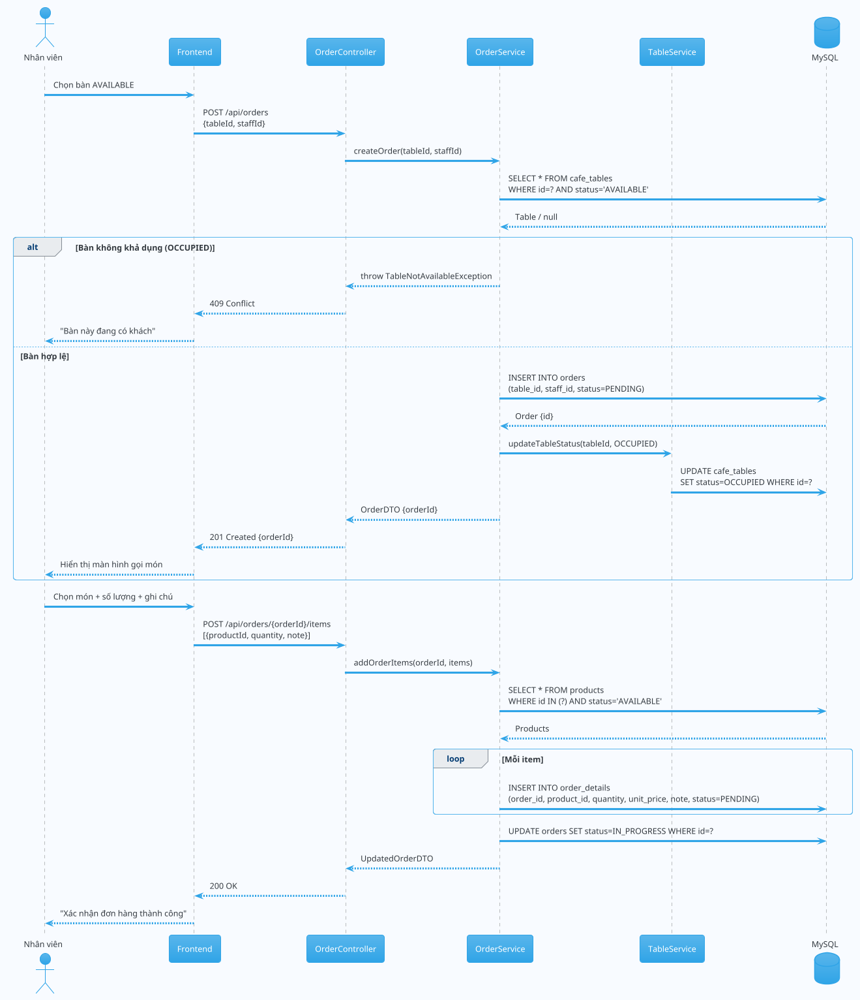
```plantuml
@startuml
!theme cerulean
skinparam backgroundColor #F8FBFF

actor "Nhân viên" as staff
participant "Frontend" as fe
participant "OrderController" as ctrl
participant "OrderService" as svc
participant "TableService" as tsvc
database "MySQL" as db

staff -> fe : Chọn bàn AVAILABLE
fe -> ctrl : POST /api/orders\n{tableId, staffId}

ctrl -> svc : createOrder(tableId, staffId)
svc -> db : SELECT * FROM cafe_tables\nWHERE id=? AND status='AVAILABLE'
db --> svc : Table / null

alt Bàn không khả dụng (OCCUPIED)
    svc --> ctrl : throw TableNotAvailableException
    ctrl --> fe : 409 Conflict
    fe --> staff : "Bàn này đang có khách"
else Bàn hợp lệ
    svc -> db : INSERT INTO orders\n(table_id, staff_id, status=PENDING)
    db --> svc : Order {id}
    svc -> tsvc : updateTableStatus(tableId, OCCUPIED)
    tsvc -> db : UPDATE cafe_tables\nSET status=OCCUPIED WHERE id=?
    svc --> ctrl : OrderDTO {orderId}
    ctrl --> fe : 201 Created {orderId}
    fe --> staff : Hiển thị màn hình gọi món
end

staff -> fe : Chọn món + số lượng + ghi chú
fe -> ctrl : POST /api/orders/{orderId}/items\n[{productId, quantity, note}]

ctrl -> svc : addOrderItems(orderId, items)
svc -> db : SELECT * FROM products\nWHERE id IN (?) AND status='AVAILABLE'
db --> svc : Products

loop Mỗi item
    svc -> db : INSERT INTO order_details\n(order_id, product_id, quantity, unit_price, note, status=PENDING)
end

svc -> db : UPDATE orders SET status=IN_PROGRESS WHERE id=?
svc --> ctrl : UpdatedOrderDTO
ctrl --> fe : 200 OK
fe --> staff : "Xác nhận đơn hàng thành công"

@enduml
```

#### 3.5.1.2 Mô tả chi tiết fields

| Tên tiếng Việt | Tên tiếng Anh | Kiểu | Bắt buộc? | Mô tả |
|---|---|---|:---:|---|
| Mã bàn | tableId | Long | ✅ | Bàn phải ở trạng thái AVAILABLE |
| Mã nhân viên | staffId | Long | ✅ | Tự động lấy từ JWT token |
| Sản phẩm | productId | Long | ✅ | Sản phẩm phải ở trạng thái AVAILABLE |
| Số lượng | quantity | Integer | ✅ | Tối thiểu 1 |
| Ghi chú | note | String | ❌ | Ghi chú đặc biệt cho món (ít đường, không đá...) |

---

### 3.5.2 UC16 – Huỷ món

#### Đặc tả Use Case

| Trường | Nội dung |
|---|---|
| **Use Case ID** | UC16 |
| **Mô tả** | Nhân viên huỷ một hoặc nhiều món trong đơn hàng đang PENDING hoặc IN_PROGRESS |
| **Tác nhân** | Admin, Manager, Staff |
| **Ưu tiên** | Trung bình (P2) |
| **Trigger** | Nhân viên chọn món trong đơn → nhấn "Huỷ món" |
| **Điều kiện cần** | Đơn hàng tồn tại; Món chưa ở trạng thái SERVED |
| **Điều kiện sau** | Món được cập nhật status → CANCELLED; Tổng tiền đơn hàng được tính lại |

**Ràng buộc nghiệp vụ:**
- Chỉ Admin và Manager được huỷ món đã ở trạng thái SERVED.
- Khi huỷ món có tính phí, hệ thống yêu cầu nhập lý do huỷ.
- Không được huỷ toàn bộ đơn khi đã có hóa đơn được tạo.

---

## 3.6 Quản lý Hóa đơn & Thanh toán

### Danh sách chức năng

| Mã | Tên chức năng | Phân hệ | Tác nhân |
|---|---|---|---|
| UC17 | Tạo hóa đơn | Billing | Admin, Manager, Cashier |
| UC18 | Áp dụng giảm giá | Billing | Admin, Manager, Cashier |
| UC19 | Thanh toán | Billing | Admin, Manager, Cashier |
| UC20 | Xem lịch sử hóa đơn | Billing | Admin, Manager, Cashier |

---

### 3.6.1 UC19 – Thanh toán

#### Đặc tả Use Case

| Trường | Nội dung |
|---|---|
| **Use Case ID** | UC19 |
| **Mô tả** | Thu ngân thực hiện thanh toán hóa đơn cho khách sau khi xác nhận tổng tiền |
| **Tác nhân** | Admin, Manager, Cashier |
| **Ưu tiên** | Cao (P1) |
| **Trigger** | Thu ngân chọn bàn cần thanh toán → nhấn "Thanh toán" |
| **Điều kiện cần** | Đơn hàng ở trạng thái IN_PROGRESS hoặc COMPLETED; Chưa có hóa đơn hoặc hóa đơn ở trạng thái UNPAID |
| **Điều kiện sau** | Hóa đơn cập nhật → PAID; Bàn → AVAILABLE; Doanh thu được ghi nhận |

**Luồng cơ bản:**

| Bước | Tác nhân | Hành động |
|---|---|---|
| 1 | Thu ngân | Chọn bàn cần thanh toán → nhấn "Tạo hóa đơn" |
| 2 | Hệ thống | Tổng hợp tất cả OrderDetail → tính subtotal |
| 3 | Thu ngân | Chọn phương thức thanh toán (Tiền mặt / Thẻ / Chuyển khoản) |
| 4 | Thu ngân | Nhập số tiền khách đưa (với thanh toán tiền mặt) |
| 5 | Hệ thống | Tính tiền thối lại (nếu có) |
| 6 | Thu ngân | Xác nhận thanh toán |
| 7 | Hệ thống | Cập nhật Invoice.payment_status → PAID |
| 8 | Hệ thống | Cập nhật Order.status → COMPLETED |
| 9 | Hệ thống | Cập nhật Table.status → AVAILABLE |
| 10 | Hệ thống | Ghi nhận vào báo cáo doanh thu |

**Luồng thay thế:**

| Trường hợp | Xử lý |
|---|---|
| A1: Áp dụng giảm giá trước khi thanh toán | Nhập % hoặc số tiền giảm → Hệ thống tính lại total_amount |
| A2: Khách thanh toán thiếu | Hệ thống không cho phép xác nhận, hiển thị số tiền thiếu |

#### 3.6.1.1 Sơ đồ luồng UC19

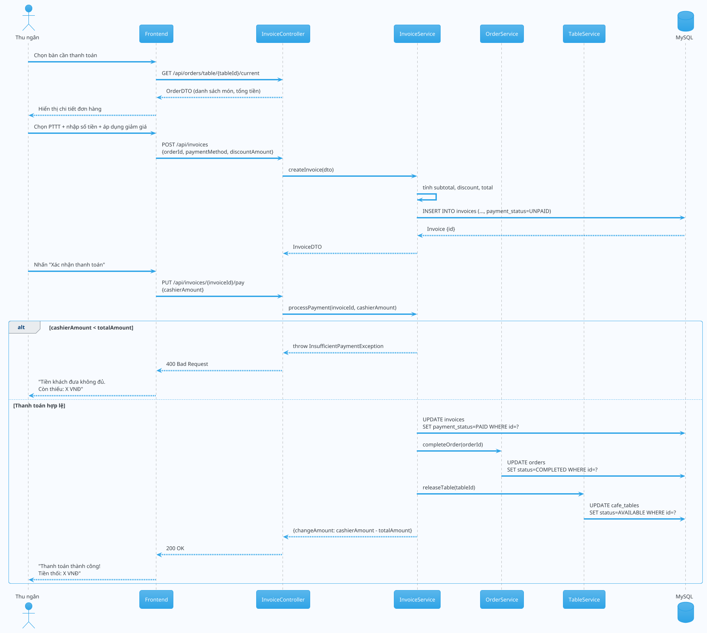
```plantuml
@startuml
!theme cerulean
skinparam backgroundColor #F8FBFF

actor "Thu ngân" as cashier
participant "Frontend" as fe
participant "InvoiceController" as ctrl
participant "InvoiceService" as svc
participant "OrderService" as osvc
participant "TableService" as tsvc
database "MySQL" as db

cashier -> fe : Chọn bàn cần thanh toán
fe -> ctrl : GET /api/orders/table/{tableId}/current
ctrl --> fe : OrderDTO (danh sách món, tổng tiền)
fe --> cashier : Hiển thị chi tiết đơn hàng

cashier -> fe : Chọn PTTT + nhập số tiền + áp dụng giảm giá
fe -> ctrl : POST /api/invoices\n{orderId, paymentMethod, discountAmount}

ctrl -> svc : createInvoice(dto)
svc -> svc : tính subtotal, discount, total
svc -> db : INSERT INTO invoices (..., payment_status=UNPAID)
db --> svc : Invoice {id}
svc --> ctrl : InvoiceDTO

cashier -> fe : Nhấn "Xác nhận thanh toán"
fe -> ctrl : PUT /api/invoices/{invoiceId}/pay\n{cashierAmount}

ctrl -> svc : processPayment(invoiceId, cashierAmount)

alt cashierAmount < totalAmount
    svc --> ctrl : throw InsufficientPaymentException
    ctrl --> fe : 400 Bad Request
    fe --> cashier : "Tiền khách đưa không đủ.\nCòn thiếu: X VNĐ"
else Thanh toán hợp lệ
    svc -> db : UPDATE invoices\nSET payment_status=PAID WHERE id=?
    svc -> osvc : completeOrder(orderId)
    osvc -> db : UPDATE orders\nSET status=COMPLETED WHERE id=?
    svc -> tsvc : releaseTable(tableId)
    tsvc -> db : UPDATE cafe_tables\nSET status=AVAILABLE WHERE id=?
    svc --> ctrl : {changeAmount: cashierAmount - totalAmount}
    ctrl --> fe : 200 OK
    fe --> cashier : "Thanh toán thành công!\nTiền thối: X VNĐ"
end

@enduml
```

#### 3.6.1.2 Mô tả chi tiết fields

| Tên tiếng Việt | Tên tiếng Anh | Kiểu | Bắt buộc? | Mô tả |
|---|---|---|:---:|---|
| Mã đơn hàng | orderId | Long | ✅ | Order tồn tại và chưa có hóa đơn PAID |
| Tạm tính | subtotal | Decimal | (tự động) | Tổng giá trị các món |
| Giảm giá | discountAmount | Decimal | ❌ | Số tiền hoặc % giảm |
| Tổng tiền | totalAmount | Decimal | (tự động) | subtotal – discountAmount |
| Phương thức TT | paymentMethod | Enum | ✅ | CASH / CARD / TRANSFER |
| Tiền khách đưa | cashierAmount | Decimal | Nếu CASH | Phải >= totalAmount |
| Tiền thối | changeAmount | Decimal | (tự động) | cashierAmount – totalAmount |
| Mã thu ngân | cashierId | Long | (tự động) | Lấy từ JWT token |

---

## 3.7 Quản lý Kho nguyên liệu

### Danh sách chức năng

| Mã | Tên chức năng | Phân hệ | Tác nhân |
|---|---|---|---|
| UC21 | Nhập kho | Inventory | Admin, Manager |
| UC22 | Xem danh sách nguyên liệu & tồn kho | Inventory | Admin, Manager |
| UC23 | Cảnh báo tồn kho thấp | Inventory | Hệ thống (tự động) |

---

### 3.7.1 UC21 – Nhập kho

#### Đặc tả Use Case

| Trường | Nội dung |
|---|---|
| **Use Case ID** | UC21 |
| **Mô tả** | Admin/Manager ghi nhận số lượng nguyên liệu nhập kho vào hệ thống |
| **Tác nhân** | Admin, Manager |
| **Ưu tiên** | Trung bình (P2) |
| **Trigger** | Người dùng vào "Kho" → nhấn "Nhập kho" |
| **Điều kiện cần** | Nguyên liệu đã được khai báo trong hệ thống |
| **Điều kiện sau** | current_stock của nguyên liệu được cộng thêm; Giao dịch IMPORT được ghi lại |

**Luồng cơ bản:**

| Bước | Mô tả |
|---|---|
| 1 | Người dùng chọn nguyên liệu cần nhập |
| 2 | Nhập số lượng và đơn giá nhập |
| 3 | Nhập ghi chú (nhà cung cấp, số lô...) |
| 4 | Xác nhận nhập kho |
| 5 | Hệ thống cập nhật current_stock += quantity |
| 6 | Hệ thống tạo bản ghi StockTransaction với type = IMPORT |

---

### 3.7.2 UC23 – Cảnh báo tồn kho thấp

#### Đặc tả Use Case

| Trường | Nội dung |
|---|---|
| **Use Case ID** | UC23 |
| **Mô tả** | Hệ thống tự động kiểm tra và cảnh báo khi tồn kho nguyên liệu dưới ngưỡng tối thiểu |
| **Tác nhân** | Hệ thống (Scheduled Task) |
| **Ưu tiên** | Trung bình (P2) |
| **Trigger** | Scheduled job chạy mỗi 30 phút HOẶC sau mỗi lần giao dịch xuất kho |
| **Điều kiện cần** | Nguyên liệu có current_stock <= min_stock_threshold |
| **Điều kiện sau** | Hiển thị badge cảnh báo trên Dashboard và trang Kho cho Admin/Manager |

**Ràng buộc nghiệp vụ:**
- Ngưỡng tối thiểu (min_stock_threshold) được cấu hình cho từng nguyên liệu.
- Nguyên liệu cảnh báo được đánh dấu màu đỏ trong danh sách kho.

**Mô tả chi tiết fields:**

| Tên tiếng Việt | Tên tiếng Anh | Kiểu | Bắt buộc? | Mô tả |
|---|---|---|:---:|---|
| Tên nguyên liệu | name | String | ✅ | 1–150 ký tự |
| Đơn vị tính | unit | String | ✅ | kg, lít, cái, gói... |
| Tồn kho hiện tại | currentStock | Decimal | (tự động) | Được tính từ tổng giao dịch |
| Ngưỡng cảnh báo | minStockThreshold | Decimal | ✅ | Khi currentStock <= ngưỡng này → cảnh báo |
| Giá nhập/đơn vị | costPerUnit | Decimal | ❌ | Dùng tính giá vốn |
| Số lượng nhập | quantity | Decimal | ✅ | Số lượng nhập trong một lần |
| Loại giao dịch | type | Enum | (tự động) | IMPORT / EXPORT / ADJUSTMENT |
| Ghi chú | note | String | ❌ | Nhà cung cấp, số lô, lý do điều chỉnh |

---

## 3.8 Báo cáo & Thống kê doanh thu

### Danh sách chức năng

| Mã | Tên chức năng | Phân hệ | Tác nhân |
|---|---|---|---|
| UC24 | Báo cáo doanh thu | Report | Admin, Manager |
| UC25 | Thống kê sản phẩm bán chạy | Report | Admin, Manager |

---

### 3.8.1 UC24 – Báo cáo doanh thu

#### Đặc tả Use Case

| Trường | Nội dung |
|---|---|
| **Use Case ID** | UC24 |
| **Mô tả** | Admin/Manager xem báo cáo doanh thu theo các khoảng thời gian khác nhau |
| **Tác nhân** | Admin, Manager |
| **Ưu tiên** | Cao (P1) |
| **Trigger** | Người dùng vào "Báo cáo → Doanh thu" |
| **Điều kiện cần** | Đã đăng nhập với role ADMIN hoặc MANAGER |
| **Điều kiện sau** | Hệ thống hiển thị biểu đồ và bảng doanh thu theo bộ lọc |

**Bộ lọc báo cáo:**

| Bộ lọc | Giá trị |
|---|---|
| Theo ngày | Chọn ngày cụ thể → tổng doanh thu ngày đó |
| Theo tuần | Chọn tuần → biểu đồ doanh thu 7 ngày |
| Theo tháng | Chọn tháng/năm → biểu đồ theo ngày trong tháng |
| Theo năm | Chọn năm → biểu đồ theo 12 tháng |
| Khoảng thời gian | Từ ngày → Đến ngày tùy chọn |

**Chỉ số hiển thị:**

| Chỉ số | Mô tả |
|---|---|
| Tổng doanh thu | Tổng total_amount của các Invoice có payment_status = PAID |
| Số lượng hóa đơn | Tổng số giao dịch thành công |
| Doanh thu TB/hóa đơn | Tổng doanh thu / Số hóa đơn |
| Phương thức thanh toán | % Tiền mặt / Thẻ / Chuyển khoản |

#### 3.8.1.1 Sơ đồ luồng UC24

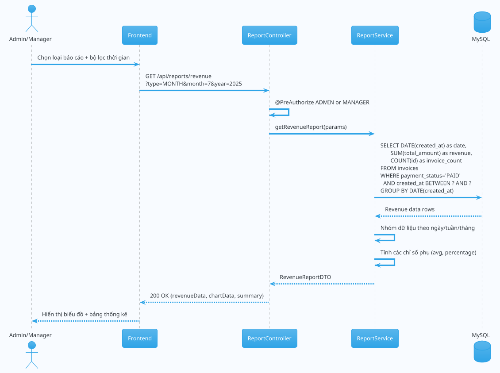
```plantuml
@startuml
!theme cerulean
skinparam backgroundColor #F8FBFF

actor "Admin/Manager" as admin
participant "Frontend" as fe
participant "ReportController" as ctrl
participant "ReportService" as svc
database "MySQL" as db

admin -> fe : Chọn loại báo cáo + bộ lọc thời gian
fe -> ctrl : GET /api/reports/revenue\n?type=MONTH&month=7&year=2025

ctrl -> ctrl : @PreAuthorize ADMIN or MANAGER
ctrl -> svc : getRevenueReport(params)

svc -> db : SELECT DATE(created_at) as date,\n       SUM(total_amount) as revenue,\n       COUNT(id) as invoice_count\nFROM invoices\nWHERE payment_status='PAID'\n  AND created_at BETWEEN ? AND ?\nGROUP BY DATE(created_at)

db --> svc : Revenue data rows

svc -> svc : Nhóm dữ liệu theo ngày/tuần/tháng
svc -> svc : Tính các chỉ số phụ (avg, percentage)
svc --> ctrl : RevenueReportDTO

ctrl --> fe : 200 OK {revenueData, chartData, summary}
fe --> admin : Hiển thị biểu đồ + bảng thống kê

@enduml
```

---

### 3.8.2 UC25 – Sản phẩm bán chạy

#### Đặc tả Use Case

| Trường | Nội dung |
|---|---|
| **Use Case ID** | UC25 |
| **Mô tả** | Hiển thị top N sản phẩm bán chạy nhất trong khoảng thời gian lọc |
| **Tác nhân** | Admin, Manager |
| **Ưu tiên** | Trung bình (P2) |
| **Trigger** | Người dùng vào "Báo cáo → Sản phẩm bán chạy" |
| **Điều kiện cần** | Có ít nhất một hóa đơn PAID trong khoảng thời gian |
| **Điều kiện sau** | Hiển thị danh sách sản phẩm sắp xếp theo số lượng bán giảm dần |

**Mô tả fields hiển thị:**

| Tên tiếng Việt | Tên tiếng Anh | Mô tả |
|---|---|---|
| Xếp hạng | rank | Thứ hạng từ 1 |
| Tên sản phẩm | productName | Tên đầy đủ |
| Danh mục | categoryName | Danh mục thuộc về |
| Số lượng bán | totalQuantitySold | Tổng số lượng trong kỳ |
| Doanh thu | totalRevenue | Tổng doanh thu từ sản phẩm này |
| % Doanh thu | revenuePercentage | % trên tổng doanh thu |

---

# PHẦN 4: CÁC COMPONENT, THÔNG BÁO, CẢNH BÁO

## 4.1 Danh sách thông báo hệ thống

| Mã | Loại | Nội dung thông báo | Điều kiện xuất hiện |
|---|---|---|---|
| MSG001 | Success | "Đăng nhập thành công!" | Đăng nhập thành công |
| MSG002 | Error | "Tên đăng nhập hoặc mật khẩu không đúng." | Sai thông tin đăng nhập |
| MSG003 | Error | "Tài khoản đã bị khoá. Vui lòng liên hệ Admin." | Tài khoản INACTIVE |
| MSG004 | Warning | "Tài khoản bị khoá tạm thời 30 phút do đăng nhập sai quá nhiều lần." | Sai 5 lần liên tiếp |
| MSG005 | Success | "Thêm nhân viên thành công." | Tạo user thành công |
| MSG006 | Error | "Tên đăng nhập đã tồn tại." | Trùng username |
| MSG007 | Error | "Email này đã được sử dụng." | Trùng email |
| MSG008 | Success | "Tạo đơn hàng thành công." | Order được tạo |
| MSG009 | Success | "Thanh toán thành công! Tiền thối: {X} VNĐ" | Invoice PAID |
| MSG010 | Error | "Không thể huỷ món đã được phục vụ." | Cancel SERVED item (không phải Admin/Manager) |
| MSG011 | Warning | "Nguyên liệu '{X}' sắp hết! Còn lại: {Y} {unit}." | Stock <= min_threshold |
| MSG012 | Success | "Nhập kho thành công. Đã thêm {X} {unit}." | Stock IMPORT |
| MSG013 | Error | "Không thể xoá sản phẩm đang có trong đơn hàng." | Delete product with active orders |
| MSG014 | Error | "Tiền khách đưa phải lớn hơn hoặc bằng tổng tiền hóa đơn." | cashierAmount < totalAmount |
| MSG015 | Success | "Chuyển bàn thành công." | Transfer table done |
| MSG016 | Warning | "Phiên đăng nhập sắp hết hạn. Bạn có muốn gia hạn?" | Token sắp hết hạn (còn 2 phút) |
| MSG017 | Success | "Đổi mật khẩu thành công. Vui lòng đăng nhập lại." | Password changed |
| MSG018 | Error | "Mật khẩu hiện tại không chính xác." | Wrong current password |

## 4.2 HTTP Response Codes chuẩn

| HTTP Code | Ý nghĩa | Trường hợp sử dụng |
|---|---|---|
| 200 OK | Thành công | GET, PUT thành công |
| 201 Created | Tạo mới thành công | POST tạo resource |
| 204 No Content | Xoá thành công | DELETE |
| 400 Bad Request | Dữ liệu đầu vào sai | Validate thất bại |
| 401 Unauthorized | Chưa xác thực | Thiếu/sai/hết hạn token |
| 403 Forbidden | Không có quyền | Role không đủ quyền |
| 404 Not Found | Không tìm thấy | Resource không tồn tại |
| 409 Conflict | Xung đột dữ liệu | Trùng username/email |
| 422 Unprocessable Entity | Logic nghiệp vụ thất bại | Tiền khách đưa thiếu, sản phẩm bị khoá |
| 500 Internal Server Error | Lỗi server | Ngoại lệ không xử lý được |

## 4.3 Cấu trúc Response API chuẩn (JSON)

**Response thành công:**

```json
{
  "success": true,
  "message": "Thao tác thành công",
  "data": {
    "id": 1,
    "username": "nhanvien01"
  },
  "timestamp": "2025-07-09T14:52:11+07:00",
  "errorCode": null
}
```

**Response lỗi:**

```json
{
  "success": false,
  "message": "Tên đăng nhập đã tồn tại",
  "data": null,
  "timestamp": "2025-07-09T14:52:11+07:00",
  "errorCode": "USER_DUPLICATE_USERNAME"
}
```

**Response lỗi validate (danh sách):**

```json
{
  "success": false,
  "message": "Dữ liệu không hợp lệ",
  "data": {
    "errors": [
      {"field": "username", "message": "Tên đăng nhập không được để trống"},
      {"field": "email", "message": "Định dạng email không hợp lệ"}
    ]
  },
  "timestamp": "2025-07-09T14:52:11+07:00",
  "errorCode": "VALIDATION_FAILED"
}
```

## 4.4 Danh sách Error Codes

| Error Code | HTTP Status | Mô tả |
|---|---|---|
| AUTH_INVALID_CREDENTIALS | 401 | Sai tên đăng nhập hoặc mật khẩu |
| AUTH_ACCOUNT_LOCKED | 403 | Tài khoản bị khoá |
| AUTH_TOKEN_EXPIRED | 401 | Token đã hết hạn |
| AUTH_TOKEN_INVALID | 401 | Token không hợp lệ |
| USER_DUPLICATE_USERNAME | 409 | Tên đăng nhập đã tồn tại |
| USER_DUPLICATE_EMAIL | 409 | Email đã tồn tại |
| USER_NOT_FOUND | 404 | Người dùng không tìm thấy |
| TABLE_NOT_AVAILABLE | 409 | Bàn không khả dụng |
| ORDER_NOT_FOUND | 404 | Đơn hàng không tìm thấy |
| PRODUCT_NOT_AVAILABLE | 422 | Sản phẩm không khả dụng |
| INVOICE_INSUFFICIENT_PAYMENT | 422 | Tiền khách đưa không đủ |
| RESOURCE_NOT_FOUND | 404 | Tài nguyên không tìm thấy |
| VALIDATION_FAILED | 400 | Dữ liệu đầu vào không hợp lệ |
| INTERNAL_SERVER_ERROR | 500 | Lỗi hệ thống |

---

# PHẦN 5: YÊU CẦU PHI CHỨC NĂNG

## 5.1 Hiệu suất (Performance)

| Yêu cầu | Chỉ số |
|---|---|
| Thời gian phản hồi API thông thường | <= 500ms |
| Thời gian phản hồi API báo cáo phức tạp | <= 2 giây |
| Thời gian phản hồi API tải ảnh | <= 1 giây |
| Số người dùng đồng thời tối thiểu | 50 người |
| Tỉ lệ uptime tối thiểu | >= 99% |
| Thời gian phục hồi sau sự cố | <= 5 phút |

## 5.2 Bảo mật (Security)

| Yêu cầu | Mô tả |
|---|---|
| Xác thực | JWT Bearer Token trong Authorization header |
| Access Token | Hết hạn sau 15 phút |
| Refresh Token | Hết hạn sau 7 ngày, lưu trong httpOnly cookie |
| Mã hoá mật khẩu | BCrypt với salt rounds = 12 |
| HTTPS | Bắt buộc trên môi trường production |
| CORS | Cấu hình chặt chẽ, chỉ cho phép domain frontend |
| Input Validation | Validate cả client-side (React) và server-side (Bean Validation) |
| SQL Injection | Phòng chống qua JPA Parameterized Query / Named Parameters |
| XSS | Sanitize input, thiết lập Content Security Policy header |
| Rate Limiting | Giới hạn 100 requests/phút/IP (Spring Rate Limiter) |
| Failed Login Limit | Khoá tạm thời 30 phút sau 5 lần sai liên tiếp |
| RBAC | Phân quyền dựa theo Role (Spring Security @PreAuthorize) |

## 5.3 Khả năng sử dụng (Usability)

| Yêu cầu | Mô tả |
|---|---|
| Ngôn ngữ giao diện | Tiếng Việt |
| Responsive Design | Hỗ trợ Desktop (1024px+) và Tablet (768px+) với Tailwind CSS |
| Thời gian tải trang đầu | <= 3 giây (First Contentful Paint) |
| Thông báo lỗi | Rõ ràng bằng tiếng Việt, chỉ rõ trường bị lỗi |
| Phản hồi thao tác | Hiển thị loading state cho mọi thao tác > 200ms |

## 5.4 Khả năng bảo trì (Maintainability)

| Yêu cầu | Mô tả |
|---|---|
| Kiến trúc | Layered Architecture (Controller → Service → Repository) |
| Coding Convention Backend | Google Java Style Guide |
| Coding Convention Frontend | Airbnb TypeScript Style Guide |
| Logging | SLF4J + Logback, log ra file theo ngày, level ERROR trở lên |
| Tài liệu API | Swagger/OpenAPI 3.0 (tự động generate từ annotations) |
| Unit Test Backend | JUnit 5 + Mockito, coverage tối thiểu 70% Service layer |
| Environment Config | Dùng application.yml, tách biến môi trường dev/prod |

## 5.5 Môi trường vận hành

| Thành phần | Yêu cầu |
|---|---|
| Hệ điều hành | Windows 10+ / Ubuntu 20.04+ |
| JDK | Java 21 (LTS) |
| Spring Boot | 3.x |
| IDE | IntelliJ IDEA 2023+ |
| Cơ sở dữ liệu | MySQL 8.0+ |
| RAM tối thiểu | 4GB (để chạy cả backend + database) |
| Dung lượng ổ cứng | Tối thiểu 10GB |
| Trình duyệt hỗ trợ | Chrome 90+, Edge 90+, Firefox 88+ |
| Maven | 3.6+ |
| Node.js (Frontend) | 18 LTS+ |

---

# PHẦN 6: THIẾT KẾ CƠ SỞ DỮ LIỆU

## 6.1 Sơ đồ Class (Domain Model)

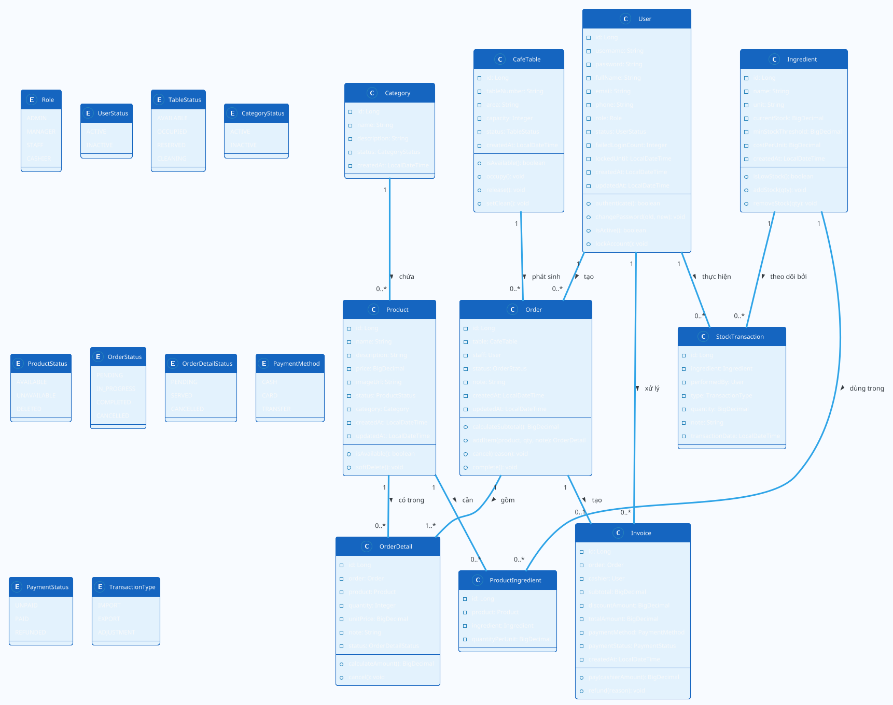
```plantuml
@startuml
!theme cerulean
skinparam backgroundColor #F8FBFF
skinparam class {
  BorderColor #1565C0
  BackgroundColor #E3F2FD
  HeaderBackgroundColor #1565C0
  HeaderFontColor #FFFFFF
}

class User {
  - id: Long
  - username: String
  - password: String
  - fullName: String
  - email: String
  - phone: String
  - role: Role
  - status: UserStatus
  - failedLoginCount: Integer
  - lockedUntil: LocalDateTime
  - createdAt: LocalDateTime
  - updatedAt: LocalDateTime
  + authenticate(): boolean
  + changePassword(old, new): void
  + isActive(): boolean
  + lockAccount(): void
}

enum Role {
  ADMIN
  MANAGER
  STAFF
  CASHIER
}

enum UserStatus {
  ACTIVE
  INACTIVE
}

class CafeTable {
  - id: Long
  - tableNumber: String
  - area: String
  - capacity: Integer
  - status: TableStatus
  - createdAt: LocalDateTime
  + isAvailable(): boolean
  + occupy(): void
  + release(): void
  + setClean(): void
}

enum TableStatus {
  AVAILABLE
  OCCUPIED
  RESERVED
  CLEANING
}

class Category {
  - id: Long
  - name: String
  - description: String
  - status: CategoryStatus
  - createdAt: LocalDateTime
}

enum CategoryStatus {
  ACTIVE
  INACTIVE
}

class Product {
  - id: Long
  - name: String
  - description: String
  - price: BigDecimal
  - imageUrl: String
  - status: ProductStatus
  - category: Category
  - createdAt: LocalDateTime
  - updatedAt: LocalDateTime
  + isAvailable(): boolean
  + softDelete(): void
}

enum ProductStatus {
  AVAILABLE
  UNAVAILABLE
  DELETED
}

class Order {
  - id: Long
  - table: CafeTable
  - staff: User
  - status: OrderStatus
  - note: String
  - createdAt: LocalDateTime
  - updatedAt: LocalDateTime
  + calculateSubtotal(): BigDecimal
  + addItem(product, qty, note): OrderDetail
  + cancel(reason): void
  + complete(): void
}

enum OrderStatus {
  PENDING
  IN_PROGRESS
  COMPLETED
  CANCELLED
}

class OrderDetail {
  - id: Long
  - order: Order
  - product: Product
  - quantity: Integer
  - unitPrice: BigDecimal
  - note: String
  - status: OrderDetailStatus
  + calculateAmount(): BigDecimal
  + cancel(): void
}

enum OrderDetailStatus {
  PENDING
  SERVED
  CANCELLED
}

class Invoice {
  - id: Long
  - order: Order
  - cashier: User
  - subtotal: BigDecimal
  - discountAmount: BigDecimal
  - totalAmount: BigDecimal
  - paymentMethod: PaymentMethod
  - paymentStatus: PaymentStatus
  - createdAt: LocalDateTime
  + pay(cashierAmount): BigDecimal
  + refund(reason): void
}

enum PaymentMethod {
  CASH
  CARD
  TRANSFER
}

enum PaymentStatus {
  UNPAID
  PAID
  REFUNDED
}

class Ingredient {
  - id: Long
  - name: String
  - unit: String
  - currentStock: BigDecimal
  - minStockThreshold: BigDecimal
  - costPerUnit: BigDecimal
  - createdAt: LocalDateTime
  + isLowStock(): boolean
  + addStock(qty): void
  + removeStock(qty): void
}

class StockTransaction {
  - id: Long
  - ingredient: Ingredient
  - performedBy: User
  - type: TransactionType
  - quantity: BigDecimal
  - note: String
  - transactionDate: LocalDateTime
}

enum TransactionType {
  IMPORT
  EXPORT
  ADJUSTMENT
}

class ProductIngredient {
  - id: Long
  - product: Product
  - ingredient: Ingredient
  - quantityPerUnit: BigDecimal
}

User "1" -- "0..*" Order : tạo >
User "1" -- "0..*" Invoice : xử lý >
User "1" -- "0..*" StockTransaction : thực hiện >
CafeTable "1" -- "0..*" Order : phát sinh >
Category "1" -- "0..*" Product : chứa >
Product "1" -- "0..*" OrderDetail : có trong >
Order "1" -- "1..*" OrderDetail : gồm >
Order "1" -- "0..1" Invoice : tạo >
Ingredient "1" -- "0..*" StockTransaction : theo dõi bởi >
Product "1" -- "0..*" ProductIngredient : cần >
Ingredient "1" -- "0..*" ProductIngredient : dùng trong >

@enduml
```

## 6.2 Thiết kế bảng dữ liệu chi tiết

### Bảng `users`

| Tên trường | Kiểu dữ liệu | Ràng buộc | Mô tả |
|---|---|---|---|
| id | BIGINT | PK, AUTO_INCREMENT, NOT NULL | Mã định danh |
| username | VARCHAR(50) | NOT NULL, UNIQUE | Tên đăng nhập |
| password | VARCHAR(255) | NOT NULL | Mật khẩu đã mã hoá BCrypt |
| full_name | VARCHAR(100) | NOT NULL | Họ và tên đầy đủ |
| email | VARCHAR(100) | NOT NULL, UNIQUE | Địa chỉ email |
| phone | VARCHAR(20) | NULL | Số điện thoại |
| role | ENUM('ADMIN','MANAGER','STAFF','CASHIER') | NOT NULL | Vai trò |
| status | ENUM('ACTIVE','INACTIVE') | NOT NULL, DEFAULT 'ACTIVE' | Trạng thái |
| failed_login_count | INT | NOT NULL, DEFAULT 0 | Số lần đăng nhập sai liên tiếp |
| locked_until | DATETIME | NULL | Thời gian khoá hết (nếu bị khoá tạm thời) |
| created_at | DATETIME | NOT NULL, DEFAULT CURRENT_TIMESTAMP | Thời gian tạo |
| updated_at | DATETIME | NULL, ON UPDATE CURRENT_TIMESTAMP | Thời gian cập nhật |

### Bảng `cafe_tables`

| Tên trường | Kiểu dữ liệu | Ràng buộc | Mô tả |
|---|---|---|---|
| id | BIGINT | PK, AUTO_INCREMENT, NOT NULL | Mã định danh |
| table_number | VARCHAR(20) | NOT NULL, UNIQUE | Ký hiệu bàn (A01, B03...) |
| area | VARCHAR(50) | NOT NULL | Khu vực |
| capacity | INT | NOT NULL, CHECK (capacity > 0) | Sức chứa tối đa |
| status | ENUM('AVAILABLE','OCCUPIED','RESERVED','CLEANING') | NOT NULL, DEFAULT 'AVAILABLE' | Trạng thái |
| created_at | DATETIME | NOT NULL, DEFAULT CURRENT_TIMESTAMP | Thời gian tạo |

### Bảng `categories`

| Tên trường | Kiểu dữ liệu | Ràng buộc | Mô tả |
|---|---|---|---|
| id | BIGINT | PK, AUTO_INCREMENT, NOT NULL | Mã định danh |
| name | VARCHAR(100) | NOT NULL, UNIQUE | Tên danh mục |
| description | TEXT | NULL | Mô tả |
| status | ENUM('ACTIVE','INACTIVE') | NOT NULL, DEFAULT 'ACTIVE' | Trạng thái |
| created_at | DATETIME | NOT NULL, DEFAULT CURRENT_TIMESTAMP | Thời gian tạo |

### Bảng `products`

| Tên trường | Kiểu dữ liệu | Ràng buộc | Mô tả |
|---|---|---|---|
| id | BIGINT | PK, AUTO_INCREMENT, NOT NULL | Mã định danh |
| name | VARCHAR(150) | NOT NULL | Tên sản phẩm |
| description | TEXT | NULL | Mô tả sản phẩm |
| price | DECIMAL(10,2) | NOT NULL, CHECK (price > 0) | Giá bán |
| image_url | VARCHAR(500) | NULL | Đường dẫn ảnh |
| status | ENUM('AVAILABLE','UNAVAILABLE','DELETED') | NOT NULL, DEFAULT 'AVAILABLE' | Trạng thái |
| category_id | BIGINT | NOT NULL, FK → categories.id | Mã danh mục |
| created_at | DATETIME | NOT NULL, DEFAULT CURRENT_TIMESTAMP | Thời gian tạo |
| updated_at | DATETIME | NULL, ON UPDATE CURRENT_TIMESTAMP | Thời gian cập nhật |

### Bảng `orders`

| Tên trường | Kiểu dữ liệu | Ràng buộc | Mô tả |
|---|---|---|---|
| id | BIGINT | PK, AUTO_INCREMENT, NOT NULL | Mã đơn hàng |
| table_id | BIGINT | NOT NULL, FK → cafe_tables.id | Mã bàn |
| staff_id | BIGINT | NOT NULL, FK → users.id | Nhân viên tạo đơn |
| status | ENUM('PENDING','IN_PROGRESS','COMPLETED','CANCELLED') | NOT NULL, DEFAULT 'PENDING' | Trạng thái |
| note | TEXT | NULL | Ghi chú đơn hàng |
| created_at | DATETIME | NOT NULL, DEFAULT CURRENT_TIMESTAMP | Thời gian tạo |
| updated_at | DATETIME | NULL, ON UPDATE CURRENT_TIMESTAMP | Thời gian cập nhật |

### Bảng `order_details`

| Tên trường | Kiểu dữ liệu | Ràng buộc | Mô tả |
|---|---|---|---|
| id | BIGINT | PK, AUTO_INCREMENT, NOT NULL | Mã chi tiết |
| order_id | BIGINT | NOT NULL, FK → orders.id | Mã đơn hàng |
| product_id | BIGINT | NOT NULL, FK → products.id | Mã sản phẩm |
| quantity | INT | NOT NULL, CHECK (quantity > 0) | Số lượng |
| unit_price | DECIMAL(10,2) | NOT NULL | Đơn giá tại thời điểm gọi món |
| note | TEXT | NULL | Ghi chú riêng cho món |
| status | ENUM('PENDING','SERVED','CANCELLED') | NOT NULL, DEFAULT 'PENDING' | Trạng thái |

### Bảng `invoices`

| Tên trường | Kiểu dữ liệu | Ràng buộc | Mô tả |
|---|---|---|---|
| id | BIGINT | PK, AUTO_INCREMENT, NOT NULL | Mã hóa đơn |
| order_id | BIGINT | NOT NULL, FK → orders.id, UNIQUE | Mã đơn hàng (quan hệ 1-1) |
| cashier_id | BIGINT | NOT NULL, FK → users.id | Thu ngân thực hiện |
| subtotal | DECIMAL(10,2) | NOT NULL | Tạm tính (trước giảm giá) |
| discount_amount | DECIMAL(10,2) | NOT NULL, DEFAULT 0.00 | Số tiền giảm |
| total_amount | DECIMAL(10,2) | NOT NULL | Tổng tiền thực thanh toán |
| payment_method | ENUM('CASH','CARD','TRANSFER') | NOT NULL | Phương thức thanh toán |
| payment_status | ENUM('UNPAID','PAID','REFUNDED') | NOT NULL, DEFAULT 'UNPAID' | Trạng thái thanh toán |
| created_at | DATETIME | NOT NULL, DEFAULT CURRENT_TIMESTAMP | Thời gian tạo hóa đơn |

### Bảng `ingredients`

| Tên trường | Kiểu dữ liệu | Ràng buộc | Mô tả |
|---|---|---|---|
| id | BIGINT | PK, AUTO_INCREMENT, NOT NULL | Mã nguyên liệu |
| name | VARCHAR(150) | NOT NULL, UNIQUE | Tên nguyên liệu |
| unit | VARCHAR(30) | NOT NULL | Đơn vị tính |
| current_stock | DECIMAL(10,3) | NOT NULL, DEFAULT 0.000 | Số lượng tồn kho hiện tại |
| min_stock_threshold | DECIMAL(10,3) | NOT NULL, DEFAULT 0.000 | Ngưỡng cảnh báo tối thiểu |
| cost_per_unit | DECIMAL(10,2) | NULL | Giá vốn mỗi đơn vị |
| created_at | DATETIME | NOT NULL, DEFAULT CURRENT_TIMESTAMP | Thời gian tạo |

### Bảng `stock_transactions`

| Tên trường | Kiểu dữ liệu | Ràng buộc | Mô tả |
|---|---|---|---|
| id | BIGINT | PK, AUTO_INCREMENT, NOT NULL | Mã giao dịch |
| ingredient_id | BIGINT | NOT NULL, FK → ingredients.id | Mã nguyên liệu |
| user_id | BIGINT | NOT NULL, FK → users.id | Người thực hiện |
| type | ENUM('IMPORT','EXPORT','ADJUSTMENT') | NOT NULL | Loại giao dịch |
| quantity | DECIMAL(10,3) | NOT NULL | Số lượng (dương = nhập, âm = xuất) |
| note | TEXT | NULL | Ghi chú |
| transaction_date | DATETIME | NOT NULL, DEFAULT CURRENT_TIMESTAMP | Thời gian giao dịch |

### Bảng `product_ingredients`

| Tên trường | Kiểu dữ liệu | Ràng buộc | Mô tả |
|---|---|---|---|
| id | BIGINT | PK, AUTO_INCREMENT, NOT NULL | Mã |
| product_id | BIGINT | NOT NULL, FK → products.id | Mã sản phẩm |
| ingredient_id | BIGINT | NOT NULL, FK → ingredients.id | Mã nguyên liệu |
| quantity_per_unit | DECIMAL(10,3) | NOT NULL | Lượng nguyên liệu dùng cho 1 sản phẩm |

## 6.3 Sơ đồ Sequence – Quá trình Tạo đơn hàng và Gọi món

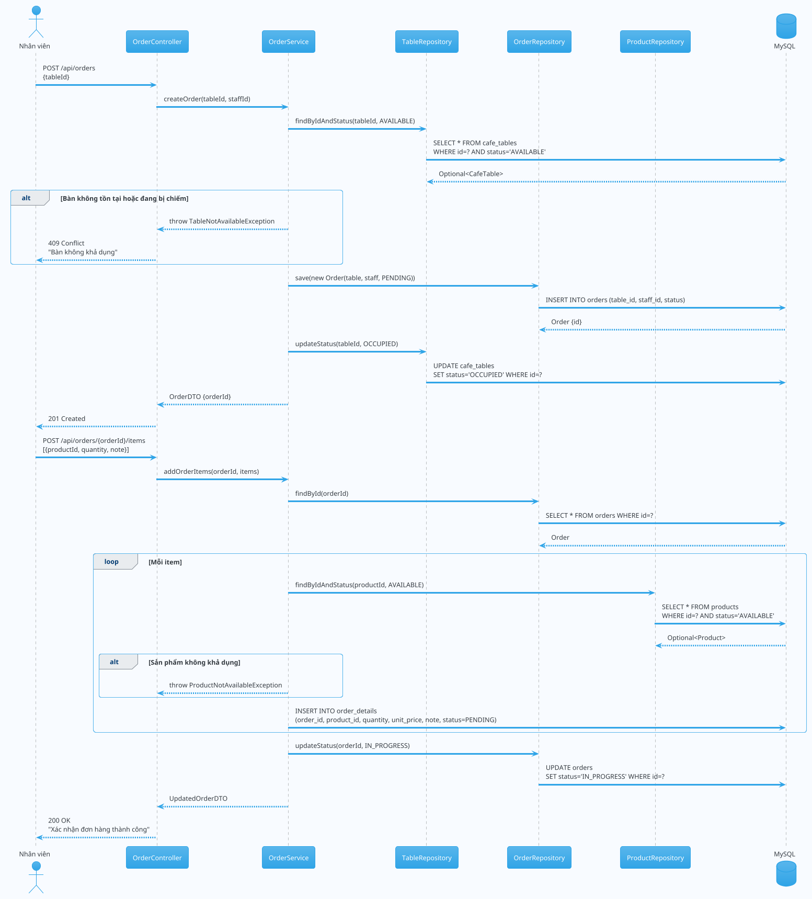
```plantuml
@startuml
!theme cerulean
skinparam backgroundColor #F8FBFF

actor "Nhân viên" as staff
participant "OrderController" as ctrl
participant "OrderService" as svc
participant "TableRepository" as trepo
participant "OrderRepository" as orepo
participant "ProductRepository" as prepo
database "MySQL" as db

staff -> ctrl : POST /api/orders\n{tableId}

ctrl -> svc : createOrder(tableId, staffId)
svc -> trepo : findByIdAndStatus(tableId, AVAILABLE)
trepo -> db : SELECT * FROM cafe_tables\nWHERE id=? AND status='AVAILABLE'
db --> trepo : Optional<CafeTable>

alt Bàn không tồn tại hoặc đang bị chiếm
    svc --> ctrl : throw TableNotAvailableException
    ctrl --> staff : 409 Conflict\n"Bàn không khả dụng"
end

svc -> orepo : save(new Order(table, staff, PENDING))
orepo -> db : INSERT INTO orders (table_id, staff_id, status)
db --> orepo : Order {id}

svc -> trepo : updateStatus(tableId, OCCUPIED)
trepo -> db : UPDATE cafe_tables\nSET status='OCCUPIED' WHERE id=?

svc --> ctrl : OrderDTO {orderId}
ctrl --> staff : 201 Created

staff -> ctrl : POST /api/orders/{orderId}/items\n[{productId, quantity, note}]

ctrl -> svc : addOrderItems(orderId, items)
svc -> orepo : findById(orderId)
orepo -> db : SELECT * FROM orders WHERE id=?
db --> orepo : Order

loop Mỗi item
    svc -> prepo : findByIdAndStatus(productId, AVAILABLE)
    prepo -> db : SELECT * FROM products\nWHERE id=? AND status='AVAILABLE'
    db --> prepo : Optional<Product>
    alt Sản phẩm không khả dụng
        svc --> ctrl : throw ProductNotAvailableException
    end
    svc -> db : INSERT INTO order_details\n(order_id, product_id, quantity, unit_price, note, status=PENDING)
end

svc -> orepo : updateStatus(orderId, IN_PROGRESS)
orepo -> db : UPDATE orders\nSET status='IN_PROGRESS' WHERE id=?

svc --> ctrl : UpdatedOrderDTO
ctrl --> staff : 200 OK\n"Xác nhận đơn hàng thành công"

@enduml
```

## 6.4 Sơ đồ Sequence – Quá trình Tạo và Thanh toán Hóa đơn

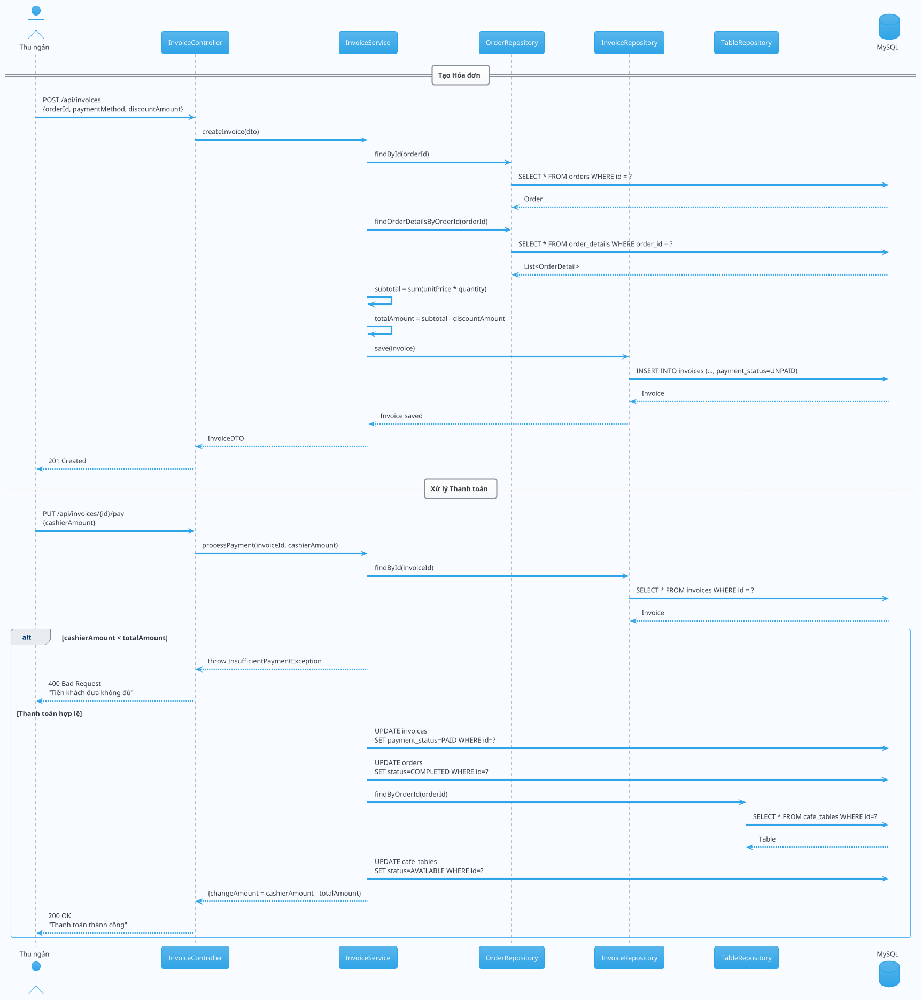
```plantuml
@startuml
!theme cerulean
skinparam backgroundColor #F8FBFF

actor "Thu ngân" as cashier
participant "InvoiceController" as ctrl
participant "InvoiceService" as svc
participant "OrderRepository" as orepo
participant "InvoiceRepository" as irepo
participant "TableRepository" as trepo
database "MySQL" as db

== Tạo Hóa đơn ==
cashier -> ctrl : POST /api/invoices\n{orderId, paymentMethod, discountAmount}

ctrl -> svc : createInvoice(dto)
svc -> orepo : findById(orderId)
orepo -> db : SELECT * FROM orders WHERE id = ?
db --> orepo : Order

svc -> orepo : findOrderDetailsByOrderId(orderId)
orepo -> db : SELECT * FROM order_details WHERE order_id = ?
db --> orepo : List<OrderDetail>

svc -> svc : subtotal = sum(unitPrice * quantity)
svc -> svc : totalAmount = subtotal - discountAmount

svc -> irepo : save(invoice)
irepo -> db : INSERT INTO invoices (..., payment_status=UNPAID)
db --> irepo : Invoice
irepo --> svc : Invoice saved
svc --> ctrl : InvoiceDTO
ctrl --> cashier : 201 Created

== Xử lý Thanh toán ==
cashier -> ctrl : PUT /api/invoices/{id}/pay\n{cashierAmount}

ctrl -> svc : processPayment(invoiceId, cashierAmount)
svc -> irepo : findById(invoiceId)
irepo -> db : SELECT * FROM invoices WHERE id = ?
db --> irepo : Invoice

alt cashierAmount < totalAmount
    svc --> ctrl : throw InsufficientPaymentException
    ctrl --> cashier : 400 Bad Request\n"Tiền khách đưa không đủ"
else Thanh toán hợp lệ
    svc -> db : UPDATE invoices\nSET payment_status=PAID WHERE id=?
    svc -> db : UPDATE orders\nSET status=COMPLETED WHERE id=?
    svc -> trepo : findByOrderId(orderId)
    trepo -> db : SELECT * FROM cafe_tables WHERE id=?
    db --> trepo : Table
    svc -> db : UPDATE cafe_tables\nSET status=AVAILABLE WHERE id=?
    svc --> ctrl : {changeAmount = cashierAmount - totalAmount}
    ctrl --> cashier : 200 OK\n"Thanh toán thành công"
end

@enduml
```

---

# PHẦN 7: LINK ISSUE

[Danh sách các mã yêu cầu trên hệ thống quản lý dự án (Jira/Trello/GitHub Issues)]

| STT | Mã Issue | Tiêu đề | Module | Trạng thái | Ghi chú |
|---|---|---|---|---|---|
| 1 | CMS-001 | Thiết lập project Spring Boot 3 + cấu hình cơ bản | Infrastructure | TODO | Maven, YAML, Docker Compose |
| 2 | CMS-002 | Thiết kế và khởi tạo cơ sở dữ liệu MySQL | Database | TODO | DDL script, initial data |
| 3 | CMS-003 | Implement Spring Security + JWT Authentication | Authentication | TODO | Access Token, Refresh Token |
| 4 | CMS-004 | API Đăng nhập / Đăng xuất (UC01, UC02) | Authentication | TODO | POST /api/auth/login, /logout |
| 5 | CMS-005 | API Đổi mật khẩu (UC03) | Authentication | TODO | PUT /api/users/change-password |
| 6 | CMS-006 | API Quản lý Nhân viên (UC04–UC07) | HR | TODO | CRUD /api/users |
| 7 | CMS-007 | API Quản lý Bàn (UC08–UC10) | Table | TODO | CRUD /api/tables |
| 8 | CMS-008 | API Quản lý Danh mục (UC11) | Menu | TODO | CRUD /api/categories |
| 9 | CMS-009 | API Quản lý Sản phẩm (UC12–UC13) | Menu | TODO | CRUD /api/products |
| 10 | CMS-010 | API Gọi món & Đặt hàng (UC14–UC16) | Order | TODO | /api/orders, /api/orders/{id}/items |
| 11 | CMS-011 | API Hóa đơn & Thanh toán (UC17–UC20) | Billing | TODO | /api/invoices |
| 12 | CMS-012 | API Kho nguyên liệu (UC21–UC23) | Inventory | TODO | /api/ingredients, /api/stock |
| 13 | CMS-013 | API Báo cáo & Thống kê (UC24–UC25) | Report | TODO | /api/reports/revenue, /top-products |
| 14 | CMS-014 | Scheduled Task: Cảnh báo tồn kho thấp (UC23) | Inventory | TODO | Spring @Scheduled |
| 15 | CMS-015 | Cấu hình Swagger/OpenAPI 3.0 | Documentation | TODO | springdoc-openapi |
| 16 | CMS-016 | Giao diện Frontend React – Setup + Auth + Dashboard | Frontend | TODO | Vite + React + Tailwind |
| 17 | CMS-017 | Giao diện Frontend React – Module Order/POS | Frontend | TODO | Quản lý bàn + Gọi món |
| 18 | CMS-018 | Giao diện Frontend React – Module Billing | Frontend | TODO | Tạo hóa đơn + Thanh toán |
| 19 | CMS-019 | Giao diện Frontend React – Module Report | Frontend | TODO | Biểu đồ doanh thu |
| 20 | CMS-020 | Unit Test Backend (JUnit 5 + Mockito) | Testing | TODO | Coverage >= 70% Service |
| 21 | CMS-021 | Integration Test API (Postman Collection) | Testing | TODO | Test tất cả endpoints |
| 22 | CMS-022 | Triển khai Backend (JAR deployment) | DevOps | TODO | application-prod.yml |

---

*Tài liệu này được tạo và quản lý theo phiên bản. Mọi thay đổi cần được ghi lại trong bảng Lịch sử tài liệu và được phê duyệt trước khi áp dụng.*

---

**Bản quyền © 2025 – Nhóm dự án CMS. Tài liệu Đặc tả Nghiệp vụ Phần mềm.**

