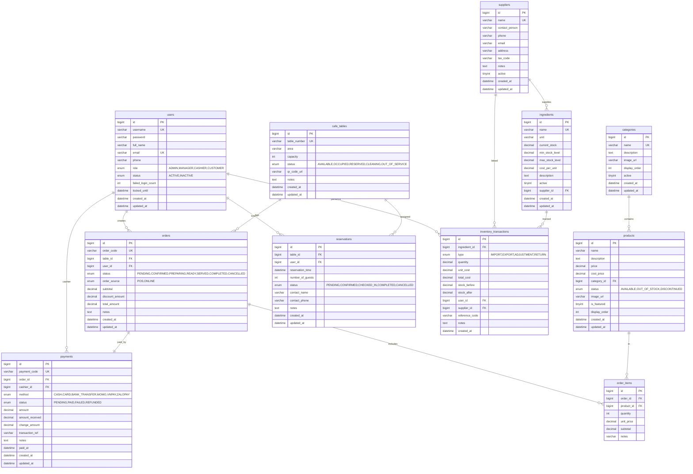
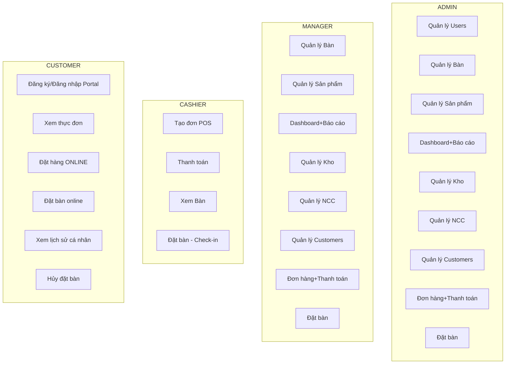
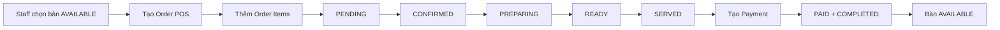
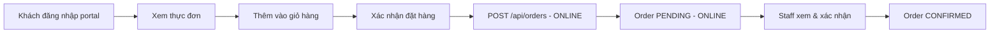
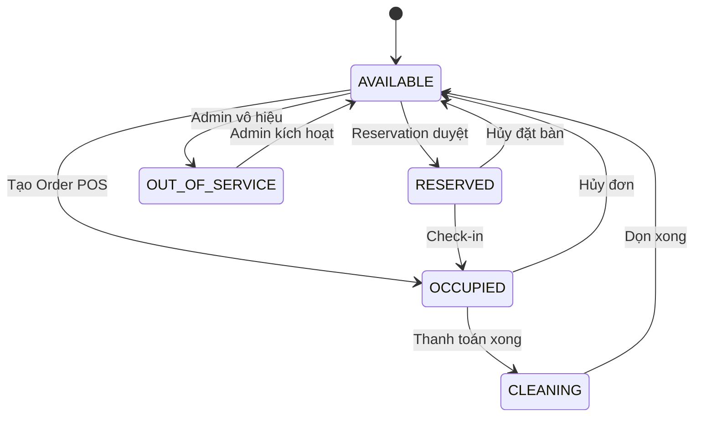
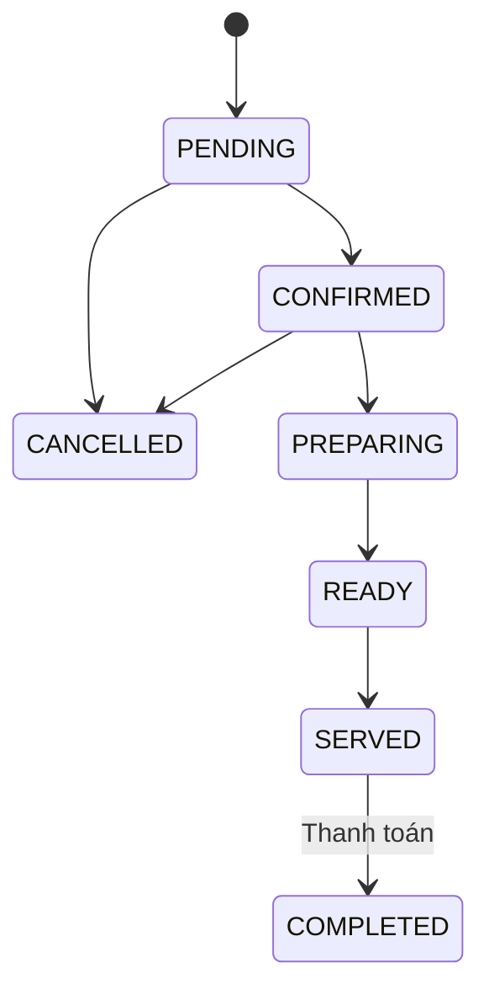
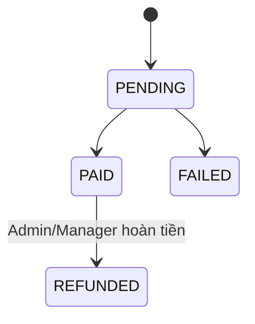
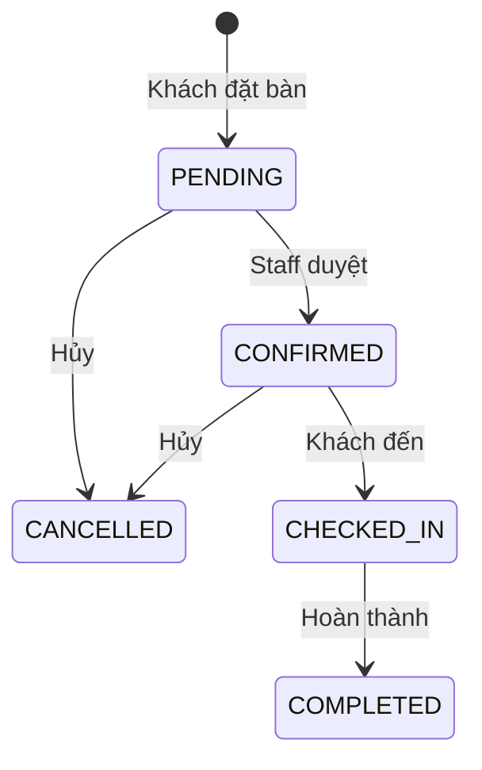

# TÀI LIỆU ĐẶC TẢ NGHIỆP VỤ
# HỆ THỐNG QUẢN LÝ QUÁN CAFE
## (Cafe Management System – CMS)

---

| **Thông tin tài liệu** | |
|---|---|
| **Dự án** | Hệ thống Quản lý Quán Cafe (CMS) |
| **Người thực hiện** | Đỗ Đức Mạnh – PTIT CNTT2 |
| **Ngày ban hành** | 08/07/2026 |
| **Mã tài liệu** | CMS-SRS-001 |
| **Phiên bản** | 2.0 |
| **Trạng thái tài liệu** | FINAL |

---

## KIỂM SOÁT TÀI LIỆU

| Ngày | Người thực hiện | Phiên bản | Nội dung |
|---|---|---|---|
| 08/07/2026 | Đỗ Đức Mạnh | 0.1 | Tạo mới tài liệu |
| 15/07/2026 | Đỗ Đức Mạnh | 1.0 | Hoàn thiện lần 1 |
| 08/08/2026 | Đỗ Đức Mạnh | 2.0 | Cập nhật đầy đủ theo source code |

---

# PHẦN 1: GIỚI THIỆU

## 1.1 Mục đích tài liệu

Tài liệu này mô tả đầy đủ các yêu cầu chức năng và phi chức năng của **Hệ thống Quản lý Quán Cafe (CMS)**.

## 1.2 Phạm vi tài liệu

| STT | Module | Mô tả |
|---|---|---|
| 1 | Xác thực & Tài khoản | Đăng nhập, đăng ký, đăng xuất, xem thông tin bản thân |
| 2 | Quản lý Người dùng | CRUD nhân viên, phân quyền, khóa/mở khóa |
| 3 | Quản lý Khách hàng | Xem, cập nhật, khóa tài khoản customer |
| 4 | Quản lý Bàn | Trạng thái bàn, thêm/sửa/xóa, tìm bàn trống |
| 5 | Quản lý Thực đơn | Danh mục, sản phẩm, giá bán |
| 6 | Gọi món & Đặt hàng | Tạo order POS và ONLINE |
| 7 | Thanh toán | Xử lý, hoàn tiền, lịch sử |
| 8 | Đặt bàn | Online, duyệt, check-in, hoàn thành, hủy |
| 9 | Kho nguyên liệu | Nhập/xuất/điều chỉnh/trả, cảnh báo tồn kho |
| 10 | Nhà cung cấp | CRUD nhà cung cấp |
| 11 | Báo cáo & Thống kê | Doanh thu theo ngày, Dashboard |
| 12 | Customer Portal | Trang chủ, thực đơn, đặt bàn, hồ sơ cá nhân |

## 1.3 Tổng quan ứng dụng

**Công nghệ sử dụng:**

| Thành phần | Công nghệ |
|---|---|
| Backend | Java 21, Spring Boot 3, Spring Data JPA, Spring Security + JWT |
| Frontend | ReactJS + TypeScript + Tailwind CSS (Vite) |
| Cơ sở dữ liệu | MySQL 8.x |
| Build Tool | Gradle |
| API Docs | Swagger / OpenAPI 3.0 (springdoc-openapi) |

## 1.4 Thuật ngữ viết tắt

| STT | Từ viết tắt | Diễn giải |
|---|---|---|
| 1 | CMS | Cafe Management System |
| 2 | SRS | Software Requirements Specification |
| 3 | API | Application Programming Interface |
| 4 | JWT | JSON Web Token |
| 5 | CRUD | Create, Read, Update, Delete |
| 6 | ERD | Entity Relationship Diagram |
| 7 | POS | Point of Sale – Điểm bán hàng tại quầy |
| 8 | ONLINE | Nguồn đơn hàng từ Customer Portal |

---

# PHẦN 2: YÊU CẦU TỔNG THỂ

## 2.1 Sơ đồ ERD (Mermaid)



## 2.2 Sơ đồ Use Case tổng thể



## 2.3 Sơ đồ luồng tổng thể

### Luồng POS



### Luồng ONLINE



## 2.4 Sơ đồ chuyển trạng thái

### Trạng thái Bàn



### Trạng thái Đơn hàng



### Trạng thái Thanh toán



### Trạng thái Đặt bàn



## 2.5 Phân quyền

### 2.5.1 Phân quyền chức năng

| Chức năng | ADMIN | MANAGER | CASHIER | CUSTOMER |
|---|:---:|:---:|:---:|:---:|
| **Xác thực** | | | | |
| Đăng nhập / Đăng xuất | ✅ | ✅ | ✅ | ✅ |
| Đăng ký tài khoản | ✅ | ✅ | ✅ | ✅ |
| Xem thông tin bản thân | ✅ | ✅ | ✅ | ✅ |
| **Quản lý Users (Nhân viên)** | | | | |
| Xem danh sách users | ✅ | ❌ | ❌ | ❌ |
| Thêm / Sửa / Xóa user | ✅ | ❌ | ❌ | ❌ |
| Khóa/Mở khóa user | ✅ | ❌ | ❌ | ❌ |
| Cập nhật profile bản thân | ✅ | ✅ | ✅ | ✅ |
| **Quản lý Khách hàng** | | | | |
| Xem danh sách customers | ✅ | ✅ | ❌ | ❌ |
| Cập nhật / Khóa / Xóa customer | ✅ | ✅ | ❌ | ❌ |
| **Quản lý Bàn** | | | | |
| Xem danh sách bàn | ✅ | ✅ | ✅ | ❌ |
| Thêm / Sửa bàn | ✅ | ✅ | ❌ | ❌ |
| Xóa bàn | ✅ | ❌ | ❌ | ❌ |
| Cập nhật trạng thái bàn | ✅ | ✅ | ✅ | ❌ |
| Tìm bàn trống (booking-search) | ✅ | ✅ | ✅ | ✅ |
| **Quản lý Danh mục** | | | | |
| Xem danh mục | ✅ | ✅ | ✅ | ✅ |
| Thêm / Sửa / Xóa danh mục | ✅ | ✅ | ❌ | ❌ |
| **Quản lý Sản phẩm** | | | | |
| Xem / Tìm kiếm sản phẩm | ✅ | ✅ | ✅ | ✅ |
| Thêm / Sửa sản phẩm | ✅ | ✅ | ❌ | ❌ |
| Cập nhật trạng thái sản phẩm | ✅ | ✅ | ❌ | ❌ |
| Xóa sản phẩm (→ DISCONTINUED) | ✅ | ❌ | ❌ | ❌ |
| **Gọi món & Đặt hàng** | | | | |
| Tạo đơn POS | ✅ | ✅ | ✅ | ❌ |
| Tạo đơn ONLINE | ✅ | ✅ | ✅ | ✅ |
| Cập nhật / Hủy đơn | ✅ | ✅ | ✅ | ❌ |
| Cập nhật trạng thái đơn | ✅ | ✅ | ✅ | ❌ |
| Xem lịch sử đơn bản thân | ❌ | ❌ | ❌ | ✅ |
| Tìm kiếm đơn hàng | ✅ | ✅ | ✅ | ❌ |
| **Thanh toán** | | | | |
| Xử lý thanh toán | ✅ | ✅ | ✅ | ❌ |
| Xem thanh toán | ✅ | ✅ | ✅ | ❌ |
| Tìm kiếm thanh toán | ✅ | ✅ | ❌ | ❌ |
| Hoàn tiền (refund) | ✅ | ✅ | ❌ | ❌ |
| **Đặt bàn (Reservation)** | | | | |
| Tạo đặt bàn | ✅ | ✅ | ✅ | ✅ |
| Tìm kiếm/xem danh sách | ✅ | ✅ | ✅ | ❌ |
| Duyệt / Check-in / Hoàn thành | ✅ | ✅ | ✅ | ❌ |
| Hủy đặt bàn | ✅ | ✅ | ✅ | ✅ (của mình) |
| Xem lịch sử đặt bàn của mình | ❌ | ❌ | ❌ | ✅ |
| **Kho nguyên liệu** | | | | |
| Xem / Tìm kiếm nguyên liệu | ✅ | ✅ | ❌ | ❌ |
| Thêm / Sửa / Bật-tắt nguyên liệu | ✅ | ✅ | ❌ | ❌ |
| Ghi nhận giao dịch kho | ✅ | ✅ | ❌ | ❌ |
| Xem tồn kho thấp | ✅ | ✅ | ❌ | ❌ |
| **Nhà cung cấp** | | | | |
| Xem / Tìm kiếm nhà cung cấp | ✅ | ✅ | ❌ | ❌ |
| Thêm / Sửa / Bật-tắt NCC | ✅ | ✅ | ❌ | ❌ |
| Xóa nhà cung cấp | ✅ | ❌ | ❌ | ❌ |
| **Báo cáo** | | | | |
| Tổng quan Dashboard | ✅ | ✅ | ❌ | ❌ |
| Báo cáo doanh thu | ✅ | ✅ | ❌ | ❌ |

### 2.5.2 Phân quyền dữ liệu

| Vai trò | Phạm vi dữ liệu |
|---|---|
| **ADMIN** | Toàn bộ dữ liệu hệ thống |
| **MANAGER** | Nghiệp vụ: bàn, sản phẩm, đơn hàng, thanh toán, kho, báo cáo, customers; không quản lý users nhân viên |
| **CASHIER** | Bàn, đơn hàng, thanh toán, đặt bàn; không kho/báo cáo |
| **CUSTOMER** | Chỉ thông tin tài khoản, đơn ONLINE và đặt bàn của mình |

## 2.6 Site Map

**CMS Admin Portal:**
```
/login              → Đăng nhập CMS
/register           → Đăng ký (public)
/dashboard          → Tổng quan [ADMIN, MANAGER]
/tables             → Quản lý bàn [ALL STAFF]
/orders             → Quản lý đơn hàng [ALL STAFF]
/payments           → Quản lý thanh toán [ALL STAFF]
/reservations       → Quản lý đặt bàn [ALL STAFF]
/products           → Quản lý sản phẩm [ALL STAFF]
/categories         → Quản lý danh mục [ADMIN, MANAGER]
/inventory          → Quản lý kho [ADMIN, MANAGER]
/suppliers          → Quản lý NCC [ADMIN, MANAGER]
/customers          → Quản lý customers [ADMIN, MANAGER]
/reports            → Báo cáo [ADMIN, MANAGER]
/users              → Quản lý users [ADMIN only]
```

**Customer Portal:**
```
/                   → Trang chủ (public)
/about              → Giới thiệu (public)
/customer-menu      → Thực đơn + Đặt hàng (yêu cầu login)
/promotions         → Khuyến mãi (public)
/contact            → Liên hệ (public)
/customer/login     → Đăng nhập Customer Portal
/customer/profile   → Hồ sơ + Lịch sử đơn hàng + Đặt bàn
```

---

# PHẦN 3: CHỨC NĂNG CHI TIẾT

## 3.1 Quản lý Xác thực & Tài khoản

| Mã | Tên chức năng | Tác nhân |
|---|---|---|
| UC01 | Đăng nhập | ADMIN, MANAGER, CASHIER, CUSTOMER |
| UC02 | Đăng xuất | Tất cả |
| UC03 | Đăng ký tài khoản | Tất cả (public) |
| UC04 | Xem thông tin bản thân | Tất cả |

### 3.1.1 UC01 – Đăng nhập

| Trường | Nội dung |
|---|---|
| **API** | POST /api/auth/login |
| **Input** | {username, password} |
| **Output** | JWT token + thông tin user (id, role, fullName) |
| **Điều kiện cần** | Tài khoản ACTIVE |

**Luồng cơ bản:**

| Bước | Hành động |
|---|---|
| 1 | Người dùng truy cập /login (CMS) hoặc /customer/login (Portal) |
| 2 | Nhập username và password |
| 3 | POST /api/auth/login |
| 4 | Hệ thống xác thực với CSDL |
| 5 | Trả về JWT + thông tin user |
| 6 | Frontend lưu token vào localStorage |
| 7 | Điều hướng theo role |

**Fields:**

| Field | Kiểu | Bắt buộc | Mô tả |
|---|---|:---:|---|
| username | String | ✅ | 4–50 ký tự, không khoảng trắng |
| password | String | ✅ | Tối thiểu 6 ký tự |

### 3.1.2 UC02 – Đăng xuất

| **API** | POST /api/auth/logout |
|---|---|
| **Ghi chú** | Hệ thống stateless JWT – frontend xóa token khỏi localStorage |

### 3.1.3 UC03 – Đăng ký tài khoản

| **API** | POST /api/auth/register |
|---|---|
| **Role mặc định** | CUSTOMER |

| Field | Kiểu | Bắt buộc |
|---|---|:---:|
| fullName | String | ✅ |
| username | String | ✅ |
| email | String | ✅ |
| phone | String | ❌ |
| password | String | ✅ |

### 3.1.4 UC04 – Xem thông tin bản thân

| **API** | GET /api/auth/me |
|---|---|
| **Auth** | Any authenticated |

---

## 3.2 Quản lý Người dùng (Admin only)

| API | Method | Mô tả | Auth |
|---|---|---|---|
| /api/users | GET | Danh sách users | ADMIN |
| /api/users/{id} | GET | Lấy theo ID | ADMIN |
| /api/users | POST | Tạo user mới | ADMIN |
| /api/users/{id} | PUT | Cập nhật user | ADMIN |
| /api/users/{id} | DELETE | Xóa user | ADMIN |
| /api/users/{id}/toggle-status | PATCH | Khóa/Mở khóa | ADMIN |
| /api/users/profile | PUT | Cập nhật profile bản thân | Any authenticated |

**Fields tạo/sửa user:**

| Field | Kiểu | Bắt buộc | Mô tả |
|---|---|:---:|---|
| fullName | String | ✅ | 2–100 ký tự |
| username | String | ✅ | 4–50 ký tự, unique |
| email | String | ✅ | Định dạng email, unique |
| phone | String | ❌ | |
| role | Enum | ✅ | ADMIN / MANAGER / CASHIER / CUSTOMER |
| password | String | ✅ (tạo mới) | Tối thiểu 6 ký tự |
| status | Enum | ❌ | Mặc định ACTIVE |

---

## 3.3 Quản lý Khách hàng

| API | Method | Mô tả | Auth |
|---|---|---|---|
| /api/customers | GET | Danh sách customers | ADMIN, MANAGER |
| /api/customers/{id} | GET | Lấy theo ID | ADMIN, MANAGER |
| /api/customers/{id} | PUT | Cập nhật (luôn role=CUSTOMER) | ADMIN, MANAGER |
| /api/customers/{id}/toggle-status | PATCH | Khóa/Mở khóa | ADMIN, MANAGER |
| /api/customers/{id} | DELETE | Xóa customer | ADMIN, MANAGER |

**Ràng buộc:** Chỉ thao tác với tài khoản có role=CUSTOMER. Không thể nâng quyền qua endpoint này.

---

## 3.4 Quản lý Bàn

| API | Method | Mô tả | Auth |
|---|---|---|---|
| /api/tables | POST | Thêm bàn | ADMIN, MANAGER |
| /api/tables/{id} | PUT | Cập nhật bàn | ADMIN, MANAGER |
| /api/tables/{id} | GET | Lấy theo ID | Any |
| /api/tables/number/{tableNumber} | GET | Lấy theo số bàn | Any |
| /api/tables | GET | Danh sách tất cả bàn | ADMIN, MANAGER, CASHIER |
| /api/tables/status/{status} | GET | Lọc theo trạng thái | ADMIN, MANAGER, CASHIER |
| /api/tables/{id}/status | PATCH | Cập nhật trạng thái | ADMIN, MANAGER, CASHIER |
| /api/tables/booking-search | GET | Tìm bàn trống | Any |
| /api/tables/{id} | DELETE | Xóa bàn | ADMIN |

**Trạng thái bàn (TableStatus):**

| Trạng thái | Mô tả |
|---|---|
| AVAILABLE | Bàn trống, sẵn sàng |
| OCCUPIED | Đang có khách |
| RESERVED | Đã đặt trước, chờ khách đến |
| CLEANING | Đang dọn dẹp |
| OUT_OF_SERVICE | Không sử dụng |

**Fields bàn:**

| Field | Kiểu | Bắt buộc | Mô tả |
|---|---|:---:|---|
| tableNumber | String | ✅ | Unique |
| area | String | ❌ | Khu vực |
| capacity | Integer | ✅ | Mặc định 4 |
| status | Enum | ❌ | Mặc định AVAILABLE |
| qrCodeUrl | String | ❌ | URL QR Code |
| notes | Text | ❌ | Ghi chú |

---

## 3.5 Quản lý Danh mục

| API | Method | Auth |
|---|---|---|
| /api/categories | POST | ADMIN, MANAGER |
| /api/categories/{id} | PUT | ADMIN, MANAGER |
| /api/categories/{id} | GET | Any |
| /api/categories | GET | Any |
| /api/categories/{id} | DELETE | ADMIN, MANAGER |

---

## 3.6 Quản lý Sản phẩm

| API | Method | Mô tả | Auth |
|---|---|---|---|
| /api/products | POST | Tạo sản phẩm | ADMIN, MANAGER |
| /api/products/{id} | PUT | Cập nhật | ADMIN, MANAGER |
| /api/products/{id} | GET | Lấy theo ID | Any |
| /api/products | GET | Tìm kiếm (phân trang, lọc category, status) | Any |
| /api/products/featured | GET | Sản phẩm nổi bật | Any |
| /api/products/available | GET | Sản phẩm đang phục vụ | Any |
| /api/products/category/{categoryId} | GET | Theo danh mục | Any |
| /api/products/{id}/status | PATCH | Cập nhật trạng thái | ADMIN, MANAGER |
| /api/products/{id} | DELETE | Xóa (→ DISCONTINUED) | ADMIN |

**ProductStatus:**

| Trạng thái | Mô tả |
|---|---|
| AVAILABLE | Đang phục vụ |
| OUT_OF_STOCK | Hết hàng tạm thời |
| DISCONTINUED | Đã ngừng kinh doanh (soft delete) |

**Fields sản phẩm:**

| Field | Kiểu | Bắt buộc | Mô tả |
|---|---|:---:|---|
| name | String | ✅ | 1–150 ký tự |
| categoryId | Long | ✅ | ID danh mục |
| price | Decimal | ✅ | >= 0 |
| costPrice | Decimal | ❌ | Giá vốn |
| description | Text | ❌ | |
| imageUrl | String | ❌ | URL hình ảnh |
| status | Enum | ✅ | AVAILABLE / OUT_OF_STOCK / DISCONTINUED |
| isFeatured | Boolean | ❌ | Sản phẩm nổi bật, mặc định false |
| displayOrder | Integer | ❌ | Mặc định 0 |

---

## 3.7 Quản lý Đặt hàng

| API | Method | Mô tả | Auth |
|---|---|---|---|
| /api/orders | POST | Tạo đơn hàng mới | Any authenticated |
| /api/orders/{id} | PUT | Cập nhật đơn | Any authenticated |
| /api/orders/{id} | GET | Lấy theo ID | Any |
| /api/orders/code/{orderCode} | GET | Lấy theo mã | Any |
| /api/orders | GET | Tìm kiếm (phân trang) | ADMIN, MANAGER, CASHIER |
| /api/orders/table/{tableId}/active | GET | Đơn đang hoạt động theo bàn | ADMIN, MANAGER, CASHIER |
| /api/orders/{id}/status | PATCH | Cập nhật trạng thái | ADMIN, MANAGER, CASHIER |
| /api/orders/{id}/cancel | PATCH | Hủy đơn | Any authenticated |
| /api/orders/customer | GET | Lịch sử đơn của customer | Any authenticated |

**OrderStatus:**

| Trạng thái | Mô tả |
|---|---|
| PENDING | Vừa tạo, chờ xác nhận |
| CONFIRMED | Đã xác nhận |
| PREPARING | Đang pha chế/chuẩn bị |
| READY | Sẵn sàng phục vụ |
| SERVED | Đã phục vụ |
| COMPLETED | Đã thanh toán |
| CANCELLED | Đã hủy |

**OrderSource:** POS | ONLINE

**Fields đơn hàng:**

| Field | Kiểu | Bắt buộc | Mô tả |
|---|---|:---:|---|
| tableId | Long | ❌ | Nullable với ONLINE |
| orderSource | Enum | ✅ | POS / ONLINE, mặc định POS |
| notes | String | ❌ | Ghi chú đơn |
| items | List | ✅ | Danh sách món: {productId, quantity, notes} |
| discountAmount | Decimal | ❌ | Giảm giá, mặc định 0 |

---

## 3.8 Quản lý Thanh toán

| API | Method | Mô tả | Auth |
|---|---|---|---|
| /api/payments | POST | Xử lý thanh toán | Any authenticated |
| /api/payments/{id} | GET | Lấy theo ID | Any |
| /api/payments/order/{orderId} | GET | Lấy theo đơn hàng | Any |
| /api/payments/code/{paymentCode} | GET | Lấy theo mã | Any |
| /api/payments | GET | Tìm kiếm (phân trang) | ADMIN, MANAGER |
| /api/payments/{id}/refund | PATCH | Hoàn tiền | ADMIN, MANAGER |

**PaymentMethod:** CASH | CARD | BANK_TRANSFER | MOMO | VNPAY | ZALOPAY

**PaymentStatus:** PENDING | PAID | FAILED | REFUNDED

**Fields thanh toán:**

| Field | Kiểu | Bắt buộc | Mô tả |
|---|---|:---:|---|
| orderId | Long | ✅ | Đơn chưa có payment PAID |
| method | Enum | ✅ | Phương thức thanh toán |
| amount | Decimal | ✅ | Tổng tiền |
| amountReceived | Decimal | Nếu CASH | Tiền khách đưa >= amount |
| changeAmount | Decimal | (tự động) | Tiền thối lại |
| transactionRef | String | ❌ | Mã giao dịch điện tử |
| notes | Text | ❌ | Ghi chú |

---

## 3.9 Quản lý Đặt bàn (Reservation)

| API | Method | Mô tả | Auth |
|---|---|---|---|
| /api/reservations | POST | Đặt bàn mới | Any authenticated |
| /api/reservations | GET | Tìm kiếm (phân trang) | ADMIN, MANAGER, CASHIER |
| /api/reservations/customer | GET | Lịch sử của customer hiện tại | CUSTOMER |
| /api/reservations/{id}/status | PATCH | Duyệt/check-in/hoàn thành | ADMIN, MANAGER, CASHIER |
| /api/reservations/{id}/cancel | PATCH | Hủy đặt bàn | Any authenticated |

**ReservationStatus:**

| Trạng thái | Mô tả |
|---|---|
| PENDING | Chờ duyệt |
| CONFIRMED | Đã xác nhận |
| CHECKED_IN | Khách đã đến, check-in xong |
| COMPLETED | Hoàn thành phiên |
| CANCELLED | Đã hủy |

**Fields đặt bàn:**

| Field | Kiểu | Bắt buộc | Mô tả |
|---|---|:---:|---|
| reservationTime | DateTime | ✅ | Phải là thời điểm tương lai |
| numberOfGuests | Integer | ✅ | Tối thiểu 1 |
| contactName | String | ✅ | Họ tên người liên hệ |
| contactPhone | String | ✅ | SĐT liên hệ |
| tableId | Long | ❌ | Nullable |
| notes | Text | ❌ | Yêu cầu đặc biệt |

---

## 3.10 Quản lý Kho nguyên liệu

| API | Method | Mô tả | Auth |
|---|---|---|---|
| /api/inventory/ingredients | POST | Thêm nguyên liệu | ADMIN, MANAGER |
| /api/inventory/ingredients/{id} | PUT | Cập nhật | ADMIN, MANAGER |
| /api/inventory/ingredients/{id} | GET | Lấy theo ID | Any |
| /api/inventory/ingredients | GET | Tìm kiếm (phân trang) | Any |
| /api/inventory/ingredients/low-stock | GET | Nguyên liệu sắp hết | ADMIN, MANAGER |
| /api/inventory/ingredients/{id}/toggle-active | PATCH | Bật/tắt | ADMIN, MANAGER |
| /api/inventory/transactions | POST | Ghi nhận giao dịch kho | ADMIN, MANAGER |
| /api/inventory/transactions | GET | Lịch sử giao dịch | ADMIN, MANAGER |
| /api/inventory/ingredients/{id}/transactions | GET | Giao dịch của 1 NL | Any |

**TransactionType:** IMPORT | EXPORT | ADJUSTMENT | RETURN

**Fields giao dịch kho:**

| Field | Kiểu | Bắt buộc | Mô tả |
|---|---|:---:|---|
| ingredientId | Long | ✅ | Nguyên liệu đã khai báo |
| type | Enum | ✅ | IMPORT / EXPORT / ADJUSTMENT / RETURN |
| quantity | Decimal | ✅ | Số lượng |
| unitCost | Decimal | ❌ | Đơn giá |
| supplierId | Long | ❌ | Nhà cung cấp |
| referenceCode | String | ❌ | Mã chứng từ |
| notes | Text | ❌ | Ghi chú |

---

## 3.11 Quản lý Nhà cung cấp

| API | Method | Mô tả | Auth |
|---|---|---|---|
| /api/suppliers | POST | Thêm NCC | ADMIN, MANAGER |
| /api/suppliers/{id} | PUT | Cập nhật | ADMIN, MANAGER |
| /api/suppliers/{id} | GET | Lấy theo ID | Any |
| /api/suppliers | GET | Tìm kiếm | Any |
| /api/suppliers/active | GET | Danh sách đang hoạt động | Any |
| /api/suppliers/{id}/toggle-active | PATCH | Bật/tắt | ADMIN, MANAGER |
| /api/suppliers/{id} | DELETE | Vô hiệu hóa | ADMIN |

---

## 3.12 Báo cáo & Dashboard

| API | Method | Mô tả | Auth |
|---|---|---|---|
| /api/dashboard | GET | Tổng quan Dashboard | ADMIN, MANAGER |
| /api/dashboard/revenue | GET | Doanh thu theo ngày (from, to) | ADMIN, MANAGER |

**Tham số báo cáo doanh thu:**
- `from`: Ngày bắt đầu (mặc định: hôm nay – 29 ngày)
- `to`: Ngày kết thúc (mặc định: hôm nay)

---

## 3.13 Customer Portal

| Trang | URL | Mô tả | Auth |
|---|---|---|---|
| Trang chủ | / | HomePage | Public |
| Giới thiệu | /about | AboutPage | Public |
| Thực đơn + Đặt hàng | /customer-menu | MenuPage | CUSTOMER |
| Khuyến mãi | /promotions | PromotionsPage | Public |
| Liên hệ | /contact | ContactPage | Public |
| Đăng nhập Portal | /customer/login | CustomerLoginPage | Public |
| Hồ sơ + Lịch sử | /customer/profile | CustomerProfilePage | CUSTOMER |

**Tính năng Customer Portal:**
- Xem thực đơn theo danh mục, thêm vào giỏ hàng, đặt hàng ONLINE
- Đặt bàn trước (POST /api/reservations)
- Xem lịch sử đơn hàng (GET /api/orders/customer)
- Xem lịch sử đặt bàn (GET /api/reservations/customer)
- Hủy đặt bàn PENDING (PATCH /api/reservations/{id}/cancel)

---

# PHẦN 4: API SPECIFICATION

## 4.1 Response chuẩn

```json
{
  "success": true,
  "message": "Thao tác thành công",
  "data": { ... },
  "timestamp": "2026-08-08T14:00:00+07:00",
  "errorCode": null
}
```

## 4.2 HTTP Status Codes

| Code | Ý nghĩa |
|---|---|
| 200 | Thành công |
| 201 | Tạo mới thành công |
| 400 | Dữ liệu đầu vào sai |
| 401 | Chưa xác thực |
| 403 | Không có quyền |
| 404 | Không tìm thấy |
| 409 | Xung đột dữ liệu |
| 500 | Lỗi server |

## 4.3 Error Codes

| Code | HTTP | Mô tả |
|---|---|---|
| AUTH_INVALID_CREDENTIALS | 401 | Sai username/password |
| AUTH_ACCOUNT_LOCKED | 403 | Tài khoản bị khóa |
| AUTH_TOKEN_EXPIRED | 401 | Token hết hạn |
| USER_DUPLICATE_USERNAME | 409 | Trùng username |
| USER_DUPLICATE_EMAIL | 409 | Trùng email |
| USER_NOT_FOUND | 404 | Không tìm thấy user |
| TABLE_NOT_AVAILABLE | 409 | Bàn không khả dụng |
| ORDER_NOT_FOUND | 404 | Không tìm thấy đơn |
| PRODUCT_NOT_AVAILABLE | 422 | Sản phẩm không khả dụng |
| VALIDATION_FAILED | 400 | Validate thất bại |
| INTERNAL_SERVER_ERROR | 500 | Lỗi hệ thống |

---

# PHẦN 5: THÔNG BÁO HỆ THỐNG

| Mã | Loại | Nội dung | Điều kiện |
|---|---|---|---|
| MSG001 | Success | "Đăng nhập thành công!" | Login OK |
| MSG002 | Error | "Tên đăng nhập hoặc mật khẩu không đúng." | Sai thông tin |
| MSG003 | Error | "Tài khoản bị khoá. Liên hệ Admin." | INACTIVE |
| MSG004 | Success | "Đăng ký tài khoản thành công!" | Register OK |
| MSG005 | Success | "Tạo đơn hàng thành công." | Order created |
| MSG006 | Success | "Thanh toán thành công!" | Payment PAID |
| MSG007 | Success | "Hoàn tiền thành công." | Refund OK |
| MSG008 | Warning | "Nguyên liệu sắp hết hàng." | Stock <= min |
| MSG009 | Success | "Đặt bàn thành công. Chờ xác nhận." | Reservation created |
| MSG010 | Success | "Hủy đặt bàn thành công." | Reservation cancelled |
| MSG011 | Error | "Tiền khách đưa phải >= tổng tiền." | Cash < amount |
| MSG012 | Success | "Đăng xuất thành công." | Logout |

---

# PHẦN 6: YÊU CẦU PHI CHỨC NĂNG

## 6.1 Hiệu suất

| Yêu cầu | Chỉ số |
|---|---|
| Thời gian phản hồi API thông thường | <= 500ms |
| Thời gian phản hồi báo cáo | <= 2 giây |
| Số người dùng đồng thời | 50 người |

## 6.2 Bảo mật

| Yêu cầu | Mô tả |
|---|---|
| Xác thực | JWT Bearer Token (stateless) |
| Mã hoá mật khẩu | BCrypt |
| CORS | Cấu hình domain frontend |
| Validate | Client (React) + Server (@Valid Bean Validation) |
| SQL Injection | JPA Parameterized Query |
| RBAC | Spring Security @PreAuthorize |
| Khóa tài khoản | lockedUntil – khóa tạm thời |

## 6.3 Khả năng bảo trì

| Yêu cầu | Mô tả |
|---|---|
| Kiến trúc | Controller → Service → Repository |
| API Docs | Swagger/OpenAPI 3.0 |
| Build Backend | Gradle |
| Build Frontend | Vite |

## 6.4 Môi trường

| Thành phần | Yêu cầu |
|---|---|
| JDK | Java 21 |
| Spring Boot | 3.x |
| Database | MySQL 8.0+ |
| Node.js | 18 LTS+ |
| Browser | Chrome 90+, Edge 90+, Firefox 88+ |

---

# PHẦN 7: THIẾT KẾ CƠ SỞ DỮ LIỆU

## 7.1 Danh sách bảng

| STT | Bảng | Entity | Mô tả |
|---|---|---|---|
| 1 | users | User | Tài khoản (ADMIN/MANAGER/CASHIER/CUSTOMER) |
| 2 | cafe_tables | CafeTable | Bàn quán |
| 3 | categories | Category | Danh mục thực đơn |
| 4 | products | Product | Sản phẩm/món ăn |
| 5 | orders | Order | Đơn hàng POS hoặc ONLINE |
| 6 | order_items | OrderItem | Chi tiết món trong đơn |
| 7 | payments | Payment | Thanh toán |
| 8 | reservations | Reservation | Đặt bàn trước |
| 9 | suppliers | Supplier | Nhà cung cấp |
| 10 | ingredients | Ingredient | Nguyên liệu |
| 11 | inventory_transactions | InventoryTransaction | Giao dịch kho |

## 7.2 Chi tiết từng bảng

### Bảng `users`

| Trường | Kiểu | Ràng buộc | Mô tả |
|---|---|---|---|
| id | BIGINT | PK, AUTO_INCREMENT | Mã định danh |
| username | VARCHAR(50) | NOT NULL, UNIQUE | Tên đăng nhập |
| password | VARCHAR(255) | NOT NULL | BCrypt |
| full_name | VARCHAR(100) | NOT NULL | Họ tên |
| email | VARCHAR(100) | NOT NULL, UNIQUE | Email |
| phone | VARCHAR(20) | NULL | SĐT |
| role | ENUM('ADMIN','MANAGER','CASHIER','CUSTOMER') | NOT NULL | Vai trò |
| status | ENUM('ACTIVE','INACTIVE') | NOT NULL, DEFAULT 'ACTIVE' | Trạng thái |
| failed_login_count | INT | NOT NULL, DEFAULT 0 | Số lần sai |
| locked_until | DATETIME | NULL | Hết hạn khóa tạm thời |
| created_at | DATETIME | NOT NULL | Tạo lúc |
| updated_at | DATETIME | NULL | Cập nhật lúc |

### Bảng `cafe_tables`

| Trường | Kiểu | Ràng buộc | Mô tả |
|---|---|---|---|
| id | BIGINT | PK | |
| table_number | VARCHAR(10) | NOT NULL, UNIQUE | Số hiệu bàn |
| area | VARCHAR(50) | NULL | Khu vực |
| capacity | INT | NOT NULL, DEFAULT 4 | Sức chứa |
| status | ENUM('AVAILABLE','OCCUPIED','RESERVED','CLEANING','OUT_OF_SERVICE') | NOT NULL, DEFAULT 'AVAILABLE' | Trạng thái |
| qr_code_url | VARCHAR(500) | NULL | QR Code |
| notes | TEXT | NULL | Ghi chú |
| created_at | DATETIME | NOT NULL | |
| updated_at | DATETIME | NULL | |

### Bảng `categories`

| Trường | Kiểu | Ràng buộc | Mô tả |
|---|---|---|---|
| id | BIGINT | PK | |
| name | VARCHAR(100) | NOT NULL, UNIQUE | Tên danh mục |
| description | TEXT | NULL | Mô tả |
| image_url | VARCHAR(500) | NULL | Hình ảnh |
| display_order | INT | NULL, DEFAULT 0 | Thứ tự |
| active | TINYINT(1) | NOT NULL, DEFAULT 1 | Hoạt động |
| created_at | DATETIME | NOT NULL | |
| updated_at | DATETIME | NULL | |

### Bảng `products`

| Trường | Kiểu | Ràng buộc | Mô tả |
|---|---|---|---|
| id | BIGINT | PK | |
| name | VARCHAR(150) | NOT NULL | Tên sản phẩm |
| description | TEXT | NULL | Mô tả |
| price | DECIMAL(12,2) | NOT NULL, >= 0 | Giá bán |
| cost_price | DECIMAL(12,2) | NULL, >= 0 | Giá vốn |
| category_id | BIGINT | NOT NULL, FK → categories.id | Danh mục |
| status | ENUM('AVAILABLE','OUT_OF_STOCK','DISCONTINUED') | NOT NULL, DEFAULT 'AVAILABLE' | Trạng thái |
| image_url | VARCHAR(500) | NULL | Hình ảnh |
| is_featured | TINYINT(1) | NOT NULL, DEFAULT 0 | Nổi bật |
| display_order | INT | NOT NULL, DEFAULT 0 | Thứ tự |
| created_at | DATETIME | NOT NULL | |
| updated_at | DATETIME | NULL | |

### Bảng `orders`

| Trường | Kiểu | Ràng buộc | Mô tả |
|---|---|---|---|
| id | BIGINT | PK | |
| order_code | VARCHAR(30) | NOT NULL, UNIQUE | Mã đơn |
| table_id | BIGINT | NULL, FK → cafe_tables.id | Bàn (nullable) |
| user_id | BIGINT | NULL, FK → users.id | Người tạo |
| status | ENUM('PENDING','CONFIRMED','PREPARING','READY','SERVED','COMPLETED','CANCELLED') | NOT NULL, DEFAULT 'PENDING' | |
| order_source | ENUM('POS','ONLINE') | NOT NULL, DEFAULT 'POS' | Nguồn |
| subtotal | DECIMAL(12,2) | NOT NULL, DEFAULT 0 | Tạm tính |
| discount_amount | DECIMAL(12,2) | NOT NULL, DEFAULT 0 | Giảm giá |
| total_amount | DECIMAL(12,2) | NOT NULL, DEFAULT 0 | Tổng tiền |
| notes | TEXT | NULL | Ghi chú |
| created_at | DATETIME | NOT NULL | |
| updated_at | DATETIME | NULL | |

### Bảng `order_items`

| Trường | Kiểu | Ràng buộc | Mô tả |
|---|---|---|---|
| id | BIGINT | PK | |
| order_id | BIGINT | NOT NULL, FK → orders.id | Đơn hàng |
| product_id | BIGINT | NOT NULL, FK → products.id | Sản phẩm |
| quantity | INT | NOT NULL, > 0 | Số lượng |
| unit_price | DECIMAL(12,2) | NOT NULL | Đơn giá tại thời điểm đặt |
| subtotal | DECIMAL(12,2) | NOT NULL | quantity × unit_price |
| notes | VARCHAR(255) | NULL | Ghi chú món |

### Bảng `payments`

| Trường | Kiểu | Ràng buộc | Mô tả |
|---|---|---|---|
| id | BIGINT | PK | |
| payment_code | VARCHAR(30) | NOT NULL, UNIQUE | Mã giao dịch |
| order_id | BIGINT | NOT NULL, FK, UNIQUE | Đơn hàng (1-1) |
| cashier_id | BIGINT | NULL, FK → users.id | Thu ngân |
| method | ENUM('CASH','CARD','BANK_TRANSFER','MOMO','VNPAY','ZALOPAY') | NOT NULL | Phương thức |
| status | ENUM('PENDING','PAID','FAILED','REFUNDED') | NOT NULL, DEFAULT 'PENDING' | |
| amount | DECIMAL(12,2) | NOT NULL | Tổng tiền |
| amount_received | DECIMAL(12,2) | NULL | Tiền khách đưa |
| change_amount | DECIMAL(12,2) | NOT NULL, DEFAULT 0 | Tiền thối |
| transaction_ref | VARCHAR(100) | NULL | Mã giao dịch điện tử |
| notes | TEXT | NULL | |
| paid_at | DATETIME | NULL | Thời điểm thanh toán |
| created_at | DATETIME | NOT NULL | |
| updated_at | DATETIME | NULL | |

### Bảng `reservations`

| Trường | Kiểu | Ràng buộc | Mô tả |
|---|---|---|---|
| id | BIGINT | PK | |
| table_id | BIGINT | NULL, FK → cafe_tables.id | Bàn (nullable) |
| user_id | BIGINT | NULL, FK → users.id | Khách hàng |
| reservation_time | DATETIME | NOT NULL | Thời gian đặt |
| number_of_guests | INT | NOT NULL | Số khách |
| status | ENUM('PENDING','CONFIRMED','CHECKED_IN','COMPLETED','CANCELLED') | NOT NULL, DEFAULT 'PENDING' | |
| contact_name | VARCHAR(100) | NOT NULL | Họ tên liên hệ |
| contact_phone | VARCHAR(20) | NOT NULL | SĐT liên hệ |
| notes | TEXT | NULL | Ghi chú |
| created_at | DATETIME | NOT NULL | |
| updated_at | DATETIME | NULL | |

### Bảng `suppliers`

| Trường | Kiểu | Ràng buộc | Mô tả |
|---|---|---|---|
| id | BIGINT | PK | |
| name | VARCHAR(150) | NOT NULL, UNIQUE | Tên NCC |
| contact_person | VARCHAR(100) | NULL | Người liên hệ |
| phone | VARCHAR(20) | NULL | SĐT |
| email | VARCHAR(100) | NULL | Email |
| address | VARCHAR(255) | NULL | Địa chỉ |
| tax_code | VARCHAR(30) | NULL | MST |
| notes | TEXT | NULL | Ghi chú |
| active | TINYINT(1) | NOT NULL, DEFAULT 1 | Hoạt động |
| created_at | DATETIME | NOT NULL | |
| updated_at | DATETIME | NULL | |

### Bảng `ingredients`

| Trường | Kiểu | Ràng buộc | Mô tả |
|---|---|---|---|
| id | BIGINT | PK | |
| name | VARCHAR(100) | NOT NULL, UNIQUE | Tên nguyên liệu |
| unit | VARCHAR(20) | NOT NULL | Đơn vị (kg, lít, hộp...) |
| current_stock | DECIMAL(10,3) | NOT NULL, DEFAULT 0 | Tồn kho |
| min_stock_level | DECIMAL(10,3) | NULL, DEFAULT 0 | Ngưỡng cảnh báo |
| max_stock_level | DECIMAL(10,3) | NULL | Tồn kho tối đa |
| cost_per_unit | DECIMAL(12,4) | NULL | Đơn giá vốn |
| description | TEXT | NULL | Mô tả |
| active | TINYINT(1) | NOT NULL, DEFAULT 1 | Đang dùng |
| supplier_id | BIGINT | NULL, FK → suppliers.id | NCC chính |
| created_at | DATETIME | NOT NULL | |
| updated_at | DATETIME | NULL | |

### Bảng `inventory_transactions`

| Trường | Kiểu | Ràng buộc | Mô tả |
|---|---|---|---|
| id | BIGINT | PK | |
| ingredient_id | BIGINT | NOT NULL, FK → ingredients.id | Nguyên liệu |
| type | ENUM('IMPORT','EXPORT','ADJUSTMENT','RETURN') | NOT NULL | Loại giao dịch |
| quantity | DECIMAL(10,3) | NOT NULL | Số lượng |
| unit_cost | DECIMAL(12,4) | NULL | Đơn giá |
| total_cost | DECIMAL(12,2) | NULL | Tổng giá trị |
| stock_before | DECIMAL(10,3) | NULL | Tồn kho trước |
| stock_after | DECIMAL(10,3) | NULL | Tồn kho sau |
| user_id | BIGINT | NULL, FK → users.id | Người thực hiện |
| supplier_id | BIGINT | NULL, FK → suppliers.id | NCC liên quan |
| reference_code | VARCHAR(50) | NULL | Mã chứng từ |
| notes | TEXT | NULL | Ghi chú |
| created_at | DATETIME | NOT NULL | |

---

# PHẦN 8: LINK ISSUE

| STT | Mã | Tiêu đề | Module | Trạng thái |
|---|---|---|---|---|
| 1 | CMS-001 | Thiết lập Spring Boot 3 + Gradle | Infrastructure | DONE |
| 2 | CMS-002 | Thiết kế CSDL MySQL | Database | DONE |
| 3 | CMS-003 | Spring Security + JWT stateless | Auth | DONE |
| 4 | CMS-004 | API Auth: login/register/logout/me | Auth | DONE |
| 5 | CMS-005 | API Users /api/users | User Mgmt | DONE |
| 6 | CMS-006 | API Customers /api/customers | Customer Mgmt | DONE |
| 7 | CMS-007 | API Tables /api/tables | Table Mgmt | DONE |
| 8 | CMS-008 | API Categories /api/categories | Menu | DONE |
| 9 | CMS-009 | API Products /api/products | Menu | DONE |
| 10 | CMS-010 | API Orders /api/orders | Order | DONE |
| 11 | CMS-011 | API Payments /api/payments | Payment | DONE |
| 12 | CMS-012 | API Inventory /api/inventory | Inventory | DONE |
| 13 | CMS-013 | API Suppliers /api/suppliers | Supplier | DONE |
| 14 | CMS-014 | API Reservations /api/reservations | Reservation | DONE |
| 15 | CMS-015 | API Dashboard /api/dashboard | Report | DONE |
| 16 | CMS-016 | Swagger/OpenAPI 3.0 | Docs | DONE |
| 17 | CMS-017 | Frontend – Setup Vite + Auth | Frontend | DONE |
| 18 | CMS-018 | Frontend – TablesPage | Frontend | DONE |
| 19 | CMS-019 | Frontend – OrdersPage | Frontend | DONE |
| 20 | CMS-020 | Frontend – PaymentsPage | Frontend | DONE |
| 21 | CMS-021 | Frontend – ReservationsPage | Frontend | DONE |
| 22 | CMS-022 | Frontend – Products + Categories | Frontend | DONE |
| 23 | CMS-023 | Frontend – InventoryPage | Frontend | DONE |
| 24 | CMS-024 | Frontend – SuppliersPage | Frontend | DONE |
| 25 | CMS-025 | Frontend – CustomersPage | Frontend | DONE |
| 26 | CMS-026 | Frontend – ReportsPage | Frontend | DONE |
| 27 | CMS-027 | Customer Portal – HomePage | Customer Portal | DONE |
| 28 | CMS-028 | Customer Portal – MenuPage + Đặt hàng ONLINE | Customer Portal | DONE |
| 29 | CMS-029 | Customer Portal – CustomerProfilePage | Customer Portal | DONE |
| 30 | CMS-030 | Customer Portal – CustomerLoginPage | Customer Portal | DONE |
| 31 | CMS-031 | Customer Portal – About, Contact, Promotions | Customer Portal | DONE |

---

*Phiên bản 2.0 – Cập nhật theo source code thực tế – 08/08/2026*

**© 2026 – Đỗ Đức Mạnh – PTIT CNTT2 – CoffeeManagement System**
